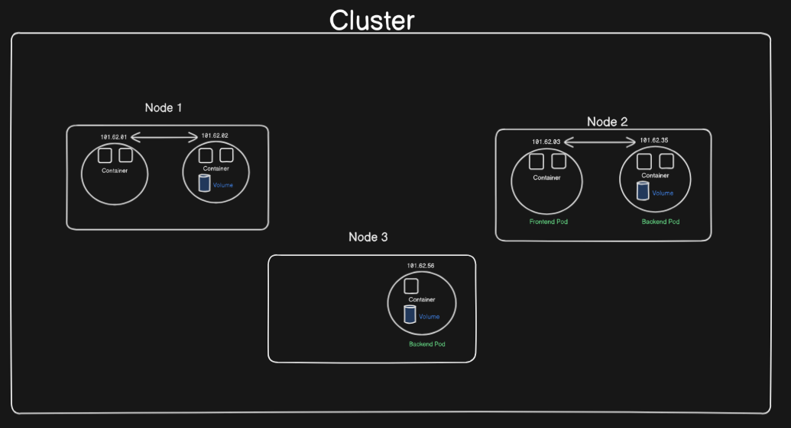

### **Components of Kubernetes**  

#### 1. **Pod**  
   - The smallest and most basic deployable unit in Kubernetes.  
   - Represents a single instance of a running process in a cluster, which can contain one or more containers.  
    


#### 2. **Node**  
   - A single physical or virtual machine in the Kubernetes cluster.  
   - Nodes run the application workloads and are managed by the master node (control plane).  


#### 3. **Cluster**  
   - A collection of nodes (both master and worker) that work together.  
   - Provides the environment where applications run and are managed.  

  

#### 4. **Replication Controller/Replica Set**  
   - Ensures that a specified number of pod replicas are running at all times.  
   - If a pod fails, it automatically creates a new one to maintain the desired count.  

#### 5. **Service**  
   - An abstraction that defines a logical set of pods and a policy to access them.  
   - Provides stable networking and load balancing for pods.  

#### 6. **Deployments**  
   - Used to manage the deployment and updates of pods in a declarative way.  
   - Supports rolling updates, rollbacks, and scaling.  

#### 7. **Secrets**  
   - Used to store and manage sensitive information like passwords, API tokens, and SSH keys securely.  

#### 8. **ConfigMap**  
   - Provides a way to inject configuration data into Kubernetes applications.  
   - Decouples configuration data from the application code.  

#### 9. **etcd**  
   - A distributed key-value store that stores the entire cluster's state and configuration.  
   - Highly available and consistent, ensuring the reliability of cluster operations.  

### **Pod**  

- In Kubernetes, we don't interact with containers (e.g., Docker containers) directly.  
- Containers are wrapped in a functional unit called a **Pod**.  
- A Pod can have:  
  - A **single container** or  
  - **Multiple containers**.  
- Each Pod is associated with a **single IP address**, ensuring that:  
  - Each Pod has a **unique IP address**.  
  - Pods communicate with each other using their **unique IP addresses**.  

#### **How Pods Get Unique IP Addresses?**  
- Pods reside within a **physical or virtual machine**, which itself has a **node-level physical IP address**.  
- Kubernetes uses **CNI (Container Network Interface)** plugins, like **Calico** or **Flannel**, to manage networking.  
- These plugins create a **virtual network** overlay, allowing each Pod to have a unique **virtual IP address** within the cluster.  
- The node’s physical IP address remains unchanged, while the Pod IPs are dynamically assigned within the cluster’s **networking CIDR range**.  


### **Node**  

- A **Node** is nothing but a **virtual machine** or a **physical machine** where **Pods** are deployed and run.  
- Nodes can be of two types:  
  - **Virtual Machines**: Examples include cloud-based instances like AWS EC2 or Azure VMs.  
  - **Physical Machines**: Bare-metal servers or on-premises machines.  


### **Cluster**  

- A **Cluster** is a unit that groups **one or more containers** together.  
- In Kubernetes, a **Cluster** consists of:  
  - **One master node** (manages the cluster).  
  - **Multiple worker nodes** (where application workloads run).  
  - A **minimum of one worker node is required** for the cluster to function properly.  

- Nodes within a cluster can be either:  
  - **Physical computers** (bare-metal servers).  
  - **Virtual machines** (cloud-based or on-premises).  

### **Control Plane**  

- The **Control Plane** is the **brain** of the Kubernetes cluster.  
- While the **Master Node** is a physical or virtual machine, the **Control Plane** is the **actual logic and programs running on the Master Node**.  
- It orchestrates the entire cluster, ensuring smooth communication between nodes and efficient deployment of applications.  
- Think of it as the **command center**, where all the crucial decisions are made—deploying Pods, scaling workloads, maintaining the desired state, and healing the cluster when things go wrong.  
- Without the Control Plane, the Kubernetes cluster is just a collection of machines with no intelligence or coordination.  

 


### **Replica Set / Replication Controller**  

- **Replica Sets** (or **Replication Controllers**) are Kubernetes mechanisms designed to ensure **high availability** of applications.  
- They act as **backups for Pods**, ensuring there are always the desired number of replicas running, even if some Pods fail.  

#### **Why Are Replica Sets Important?**  
- In the **real world**, application downtime can cost **revenue** and damage **user trust**.  
- To avoid such **downtime**, Replica Sets ensure that:  
  - If a Pod **crashes** or **shuts down unexpectedly**, a new Pod is **immediately spun up**.  
  - The new Pod is assigned a **new IP address**, but the application remains available without interruption.  

#### **How Are Replica Sets Configured?**  
- Replica Sets are defined when configuring the **Deployment object**.  
- Developers specify the **desired number of replicas** to ensure continuous availability.  

#### **Cool Fact**  
- Replica Sets are like **guardians** of your Pods. No matter how many Pods fail, they’ll work tirelessly to bring the application back to its ideal state.  
- They enable **rolling updates**, ensuring zero downtime even during version upgrades.  

Let me know the next component or if you want to add more details!


### **Service**  

#### **Scenario Recap:**
- In Kubernetes, a **Pod's IP address is dynamic**, meaning it changes whenever a Pod is recreated. This creates a problem when Pods need to communicate, such as a **front-end Pod** interacting with a **back-end Pod**.  
- If the **back-end Pod crashes** and a new one is created by the **Replica Set**, it will get a **new IP address**. The front-end Pod must be updated with this new IP to maintain communication, which isn't feasible to configure manually each time.  

#### **Solution: Service**  
- **Services** are a Kubernetes abstraction that provides a **stable IP address** and **DNS name** for a group of Pods.  
- Instead of Pods communicating directly with each other's dynamic IPs, they use the **Service's IP or DNS name**, which remains constant.  

#### **How It Works:**  
1. Pods are labeled with **selectors** that identify their role (e.g., `app=backend`).  
2. The **Service** uses this label to track and associate all related Pods dynamically.  
3. Even if a Pod fails and a new one is created, the Service updates its routing automatically.  
4. Front-end Pods communicate with back-end Pods via the Service, ensuring uninterrupted communication.  

#### **Benefits of Services:**  
- Eliminates the need for manual configuration of Pod IPs.  
- Provides a **static entry point** (IP/DNS) for dynamic Pods.  
- Ensures **load balancing** among Pods if multiple back-end Pods exist.  

#### **Key Points for Your Scenario:**  
- No manual configuration is needed for the front-end Pod to connect to the back-end Pod.  
- The Service ensures that traffic is routed to the available back-end Pod, even if Pods fail and are recreated.  
- **One Service** can manage communication for **multiple Pods** with the same labels.  

### **Types of Services in Kubernetes**  

#### 1. **ClusterIP**  
- **Default Service Type**: If no type is specified, the Service is created as a **ClusterIP**.  
- **Purpose**: Allows communication **within the cluster**.  
- **Accessible From**: Other Pods inside the cluster.  
- **Not Externally Accessible**: This service type does not expose the application to the outside world.  
- **Use Case**:  
  - Internal microservices communication (e.g., front-end Pod talking to back-end Pod).  

#### 2. **NodePort**  
- **Purpose**: Exposes the application to the **outside world** via a static port on each Node's IP address.  
- **Accessible From**:  
  - Any external system can access the service using `<NodeIP>:<NodePort>`.  
- **How It Works**:  
  - A port is opened on each Node in the cluster.  
  - Traffic to this port is forwarded to the Pods behind the Service.  
- **Use Case**:  
  - Quick testing or simple setups without needing an external load balancer.  

#### 3. **LoadBalancer**  
- **Purpose**: Exposes the Service externally using a **cloud provider’s load balancer**.  
- **Accessible From**:  
  - External clients access it via a single external IP.  
- **How It Works**:  
  - Combines **ClusterIP** and **NodePort** and adds a load balancer in front of the nodes.  
- **Use Case**:  
  - Production-level applications where **high availability** and **external access** are crucial.  

#### **Quick Summary Table**  

| **Service Type** | **Access**              | **Use Case**                           |  
|------------------|-------------------------|----------------------------------------|  
| **ClusterIP**    | Internal (within cluster) | Microservices communication inside the cluster. |  
| **NodePort**     | External via `<NodeIP>:<Port>` | Expose the application for quick testing or simple external access. |  
| **LoadBalancer** | External with load balancing | Production-level, scalable applications exposed to the internet. |  


### **Deployment in Kubernetes**  

A **Deployment** is a Kubernetes object used to manage and control Pods in a declarative manner. It is a higher-level abstraction for managing **replica sets** and ensuring that your application is always up and running with the desired number of instances.  

#### **Key Features of Deployments**  
1. **Scaling**:  
   - You can increase or decrease the number of Pods (replicas) for an application using Deployments.  
   - Example: To handle more user traffic, you can scale up the application to run more Pods.  

2. **Rolling Updates**:  
   - Deployments allow updating the application without downtime by gradually replacing Pods with updated versions.  

3. **Rollback**:  
   - If an update fails, you can roll back to a previous working version of your application.  

4. **Self-Healing**:  
   - If a Pod crashes or becomes unresponsive, Deployments automatically recreate it to maintain the desired state.  

---

#### **Basic Command for Deployment Creation**  
```bash
kubectl create deployment first-deployment --image=<docker-image-name> --port=8080 --replicas=4
```

- **Command Explanation**:  
  1. **first-deployment**: The name of the Deployment object.  
  2. **--image=<docker-image-name>**: Docker image for the application, either from a local or remote repository.  
  3. **--port=8080**: The port that the container inside each Pod will use.  
  4. **--replicas=4**: Number of Pods (instances) that Kubernetes will maintain.  

---

#### **Understanding Pods and Replicas**  
- Each **replica** corresponds to a new **Pod**.  
- Pods cannot share the same IP address and port on a single Node.  
  - Example: If 4 replicas are requested, Kubernetes will create **4 distinct Pods**, each with a unique Pod IP but running the same application.  
- **Reason**:  
  - The port specified (8080) refers to the **container port inside each Pod**, not the Pod's external port.  
  - Multiple replicas cannot exist inside a single Pod because they need isolation and unique IP addresses for communication.  

---

#### **Example Scenario**  
Imagine you deploy 4 replicas of your application using the command above.  
- Kubernetes will:  
  1. Create 4 Pods, each with the same Docker image and running the application on port 8080.  
  2. Assign unique IP addresses to each Pod for communication within the cluster.  
  3. Ensure that if any Pod fails, it is replaced automatically to maintain the desired state.  


### **Secrets and ConfigMap in Kubernetes**  

#### **Why Use Secrets and ConfigMaps?**  
Secrets and ConfigMaps are Kubernetes objects designed to manage sensitive and non-sensitive configuration data **outside the application code**, making deployments secure, flexible, and scalable.  

---

#### **Problem with Application Properties Files**  
In traditional applications like a Spring Boot CRUD app, configurations (like passwords, API keys, database properties, etc.) are often stored in files such as `application.properties` or `application.yml`.  

**Why are they not secure?**  
1. **Direct Exposure**:  
   - These files are stored as part of the application package and are **readable by anyone** with access to the code or Docker image.  
2. **Hardcoding Issues**:  
   - Sensitive data is directly embedded in the application, making it vulnerable if the code repository is compromised.  

**Challenges in Updating Configuration**:  
- When configuration changes are needed:  
  1. Update the file.  
  2. Rebuild and test the code.  
  3. Create a new Docker image.  
  4. Redeploy the application.  

This process is time-consuming and prone to errors.  

---

#### **How Secrets and ConfigMaps Solve These Issues**  

1. **Managed Outside the Pod**:  
   - Secrets and ConfigMaps are stored **in the Node** but accessed by Pods during runtime.  
   - **Why?**  
     - Multiple Pods can share the same configuration, ensuring consistency.  
     - Updating a Secret or ConfigMap doesn’t require rebuilding or redeploying the application.  

2. **Dynamic Updates**:  
   - Changes made to Secrets or ConfigMaps can be automatically reflected in the Pods without restarting or redeploying them (if properly configured).  

---

#### **Secrets**  
- **Purpose**: Store sensitive information in an encrypted format.  
- **Examples of Data to Store**:  
  - API keys  
  - Database passwords  
  - Certificates  
- **Security Features**:  
  - Data is stored in **base64-encoded** format and transferred securely within the cluster.  

---

#### **ConfigMaps**  
- **Purpose**: Store non-sensitive configuration data in plain text.  
- **Examples of Data to Store**:  
  - URLs  
  - Port numbers  
  - Key-value pairs  
- **Advantages**:  
  - Separate configuration from code, making applications more portable and easier to manage.  

---

#### **Key Differences Between Secrets and ConfigMaps**  
| Feature           | Secrets                          | ConfigMaps                     |  
|--------------------|----------------------------------|--------------------------------|  
| **Purpose**        | Store sensitive data            | Store non-sensitive data       |  
| **Format**         | Encrypted (base64-encoded)      | Plain text                     |  
| **Examples**       | Passwords, API keys, certs      | Port numbers, URLs, app configs |  

---

#### **How They Work in Kubernetes**  
1. **Creation**:  
   - Both Secrets and ConfigMaps are created using `kubectl` commands or YAML manifests.  

2. **Mounting**:  
   - These objects are **mounted as volumes** inside Pods or accessed as environment variables.  

3. **Accessibility**:  
   - Stored at the Node level and shared with Pods as needed.  

---

#### **Real-World Scenario**  
Imagine a Spring Boot app:  
1. Database credentials (password, username) are stored in **Secrets**.  
2. Application-level configurations (URLs, ports) are stored in **ConfigMaps**.  
3. Both are mounted as environment variables or files inside the Pods.  

**Benefit**: Any updates to Secrets or ConfigMaps don’t require changes in the application code, Docker image, or redeployment.  


### **ETCD in Kubernetes**  

#### **What is ETCD?**  
- **ETCD** is a **distributed, key-value database** used as the **primary datastore for Kubernetes**.  
- It stores **all the cluster state and configuration data** in a reliable and consistent manner.  

---

#### **What Does ETCD Store?**  
1. **Cluster State**:  
   - Details about nodes, pods, deployments, services, etc.  
2. **Configuration Data**:  
   - Secrets, ConfigMaps, and other Kubernetes objects.  
3. **Metadata**:  
   - Cluster policies, events, and runtime configurations.  

---

#### **Secrets and ConfigMaps in ETCD**  
- Both Secrets and ConfigMaps are stored in the **ETCD database**.  
- **Why is there a 1 MB Limit for Secrets?**  
  - ETCD imposes a **1 MB size limit per object**, including Secrets.  
  - This is to prevent overloading the database and to ensure performance and stability.  
  - If data exceeds this limit, you might need to split it into multiple Secrets or ConfigMaps.  


---

#### **Why Use ETCD in Kubernetes?**  
1. **Distributed System**:  
   - ETCD is highly available and supports leader election, ensuring the cluster can operate even if some nodes fail.  
2. **Consistency**:  
   - It ensures **strict consistency** across the cluster, which is critical for the proper functioning of Kubernetes.  
3. **Backup and Recovery**:  
   - Since ETCD stores all cluster data, it is the single source of truth and must be backed up regularly to recover from failures.  

---

#### **Example Scenario**  
Imagine a Kubernetes cluster:  
1. A ConfigMap is created for storing application URLs.  
2. A Secret is created for storing a database password.  
3. Both are stored in ETCD in **base64-encoded format** for security.  
4. Pods access this data through environment variables or mounted volumes.  

If ETCD fails, the entire cluster loses its state and becomes non-functional.  

---

#### **Limitations of ETCD**  
1. **Size Constraints**:  
   - As mentioned, a single object (like Secrets or ConfigMaps) cannot exceed **1 MB**.  
2. **High Memory Usage**:  
   - ETCD is memory-intensive and requires careful resource allocation.  
3. **Dependency on Backups**:  
   - Since it is the single source of truth, regular backups are critical to avoid catastrophic data loss.  

---

