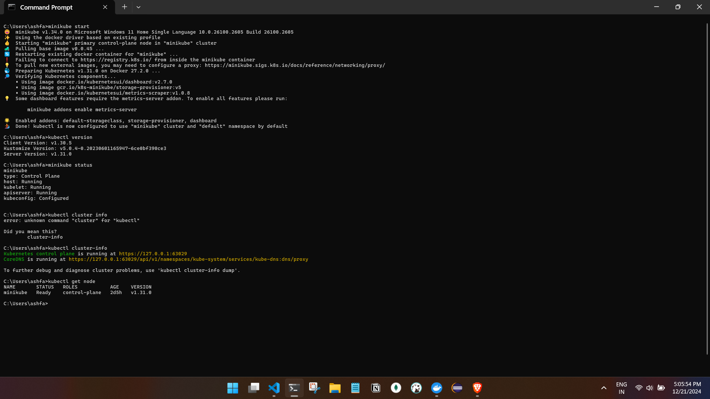

### **Installing Kubernetes on Windows using Minikube**

---

#### **Introduction to Minikube**  
Minikube is a tool designed to run a **single-node Kubernetes cluster** locally. It is commonly used for **testing** and **development** purposes, providing a lightweight way to experience Kubernetes on a local machine without needing a full multi-node cluster.

- Minikube will create a **single node** that acts both as the **master** and the **worker node**. Although it is running on a single machine, Minikube configures the environment to act as if there is a Kubernetes **master node** (responsible for the control plane) and **worker nodes** (responsible for running containers). This allows us to simulate how Kubernetes works in a real multi-node cluster, even though it's all running on one system.

---

#### **Prerequisites**  
1. **Docker Desktop**  
   - Minikube relies on a **container runtime** to run the Kubernetes pods, and Docker Desktop serves as the default container runtime in this case.  
   - If we already have **Docker Desktop installed**, ensure that Kubernetes is enabled within Docker Desktop. we can do this by going to **Docker Desktop settings** and enabling **Kubernetes**. This will allow Docker Desktop to act as the environment for running our Kubernetes nodes.

2. **Minikube**  
   - Minikube itself needs to be installed on our Windows machine. This can be done by following the official Minikube installation guide, typically using **Chocolatey** or **direct downloads**.
   link - [URL](https://minikube.sigs.k8s.io/docs/start/?arch=%2Fwindows%2Fx86-64%2Fstable%2Fwindows+package+manager#Service)
   link - [URL2](https://youtu.be/YCGD29lk0ss?si=Alkc9xpbr7MJfaSx)

3. **kubectl**  
   - **kubectl** is the Kubernetes command-line tool used to interact with our Kubernetes cluster.  
   - When we install **Minikube**, it typically installs **kubectl** as part of the process.  
   - However, if kubectl is not installed automatically, we can install it separately by downloading it from the official Kubernetes website or using **Choco** for Windows.

---

#### **How Kubernetes Works with Minikube**  
- In Minikube, the **single-node cluster** behaves like a full Kubernetes cluster but with a single machine acting as both the **control plane** (master node) and the **worker node**.  
- Even though Minikube only runs on one machine, it **simulates** the different roles (master and worker nodes) in the cluster by utilizing virtual machines or containers for the node components. This allows we to test and run Kubernetes workloads as if they were on separate nodes in a real-world environment.

---


#### **Check kubectl Installation**  
   - If Minikube has successfully been installed, and Docker Desktop with Kubernetes is enabled, check if **kubectl** is working by running the following command in our terminal:
     ```bash
     kubectl version
     ```
   - If we see the Kubernetes client and server versions, that means **kubectl** is correctly configured.

---

#### **Starting Minikube**  
Once everything is set up, we can start Minikube with the following command:
```bash
minikube start
```
This will start our single-node Kubernetes cluster, and we can begin interacting with it using **kubectl** commands.

---

#### **Conclusion**  
With **Minikube**, we can simulate a full Kubernetes environment on a single machine. Docker Desktop provides the necessary container runtime, and Minikube acts as the orchestrator. **kubectl** can either be installed separately or automatically managed by Minikube/Docker Desktop, making it easier for developers to test and develop applications locally in a Kubernetes environment.


