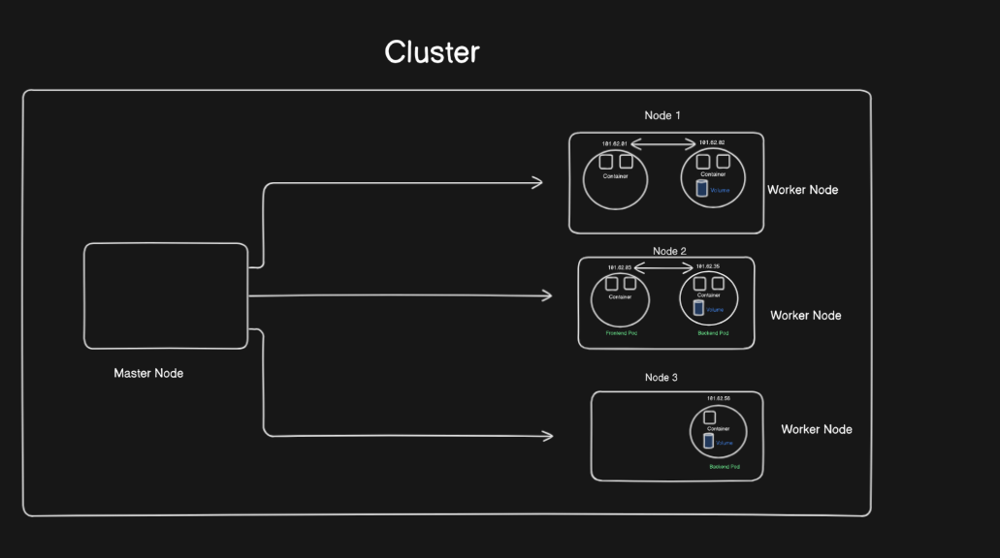
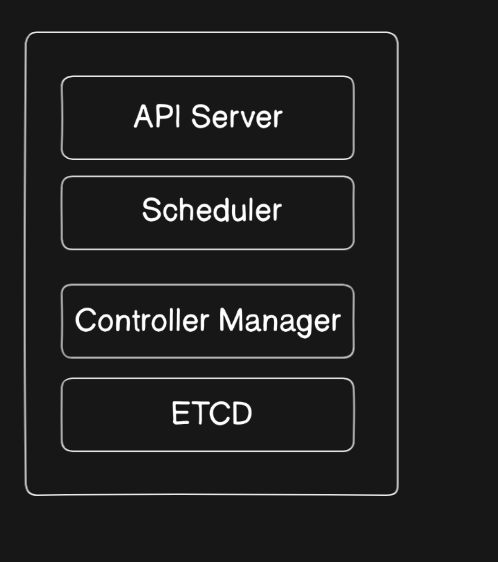
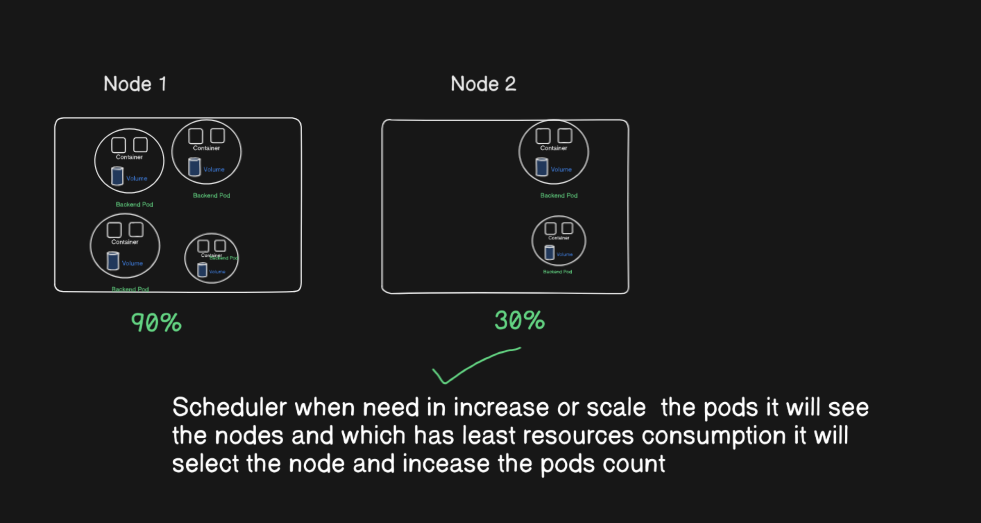
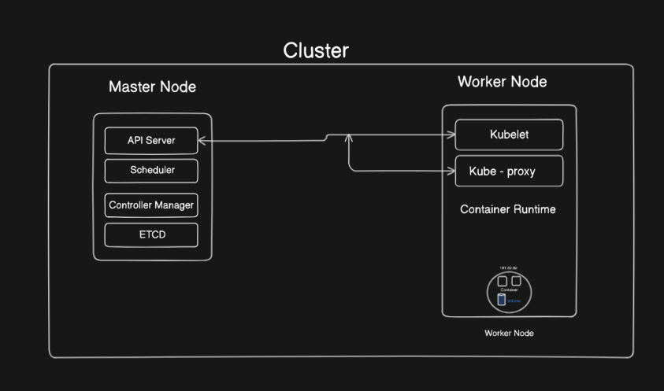

### **Architecture of Kubernetes (Chiba Noticeman)**  

#### **Introduction**  
Kubernetes, also referred to as Chiba Noticeman here, is an open-source platform for automating the deployment, scaling, and management of containerized applications. It provides high availability, fault tolerance, and scalability through its distributed architecture.  

---

### **Components of the Kubernetes Architecture**  

#### **1. Master Node**  
- The **Master Node** is responsible for managing the entire Kubernetes cluster.  
- It ensures that the worker nodes and the pods running inside them are functioning smoothly.  
- It uses the **Control Plane** internally, which acts as the "brain" of the system.  

#####  Master Node and its Components:  

### **API Server**  

#### **Introduction**  
The **API Server** is the entry point to the Kubernetes cluster. It acts as the **cluster gateway**, ensuring that all requests coming into the cluster are routed and processed correctly.  

---

#### **Key Responsibilities of the API Server**  
1. **Request Handling**:  
   All requests to perform operations on the cluster first go through the API server.  
2. **API Exposure**:  
   Exports APIs to interact with and manage the cluster, such as accessing the status of nodes, pods, or other resources.  
3. **Authentication and Validation**:  
   Intercepts and validates the incoming requests to ensure security and correctness.  
4. **Routing**:  
   Routes the request to appropriate components of the control plane or worker nodes based on the operation.

---

#### **Ways to Access the API Server**  

1. **kubectl Command-Line Tool**:  
   - The most commonly used tool for interacting with Kubernetes clusters.  
   - Some useful commands include:  
     
     | **Command**                | **Description**                         |  
     |----------------------------|-----------------------------------------|  
     | `kubectl get pods`         | Retrieves the list and status of pods. |  
     | `kubectl get nodes`        | Retrieves the list and status of nodes.|  
     | `kubectl describe pod <pod-name>` | Gives detailed information about a pod.|  
     | `kubectl logs <pod-name>`  | Fetches logs from a specific pod.       |  
     | `kubectl apply -f <file>`  | Deploys a resource from a YAML file.    |  

2. **Kubernetes UI (Dashboard)**:  
   - Provides a **web-based interface** to monitor and interact with the cluster.  
   - Features include:  
     - Monitoring the health of pods and nodes.  
     - Viewing resource usage and application deployments.  
     - Managing cluster resources without needing CLI commands.

---

#### **How the API Server Works**  
1. When a command like `kubectl get pods` is run:  
   - The request does not directly reach the worker nodes.  
   - Instead, the API server **intercepts** the request and processes it.  

2. The API server then:  
   - **Checks the current state** of the cluster, including all worker nodes and the pods running inside them.  
   - Retrieves the requested information (e.g., pod status) and sends it back to the user.  

---

#### **Why the API Server is Crucial**  
- Ensures consistency and coordination within the cluster.  
- Acts as the **single source of truth** for the cluster state.  
- Handles all cluster communication, ensuring secure and efficient operations.  

### **Scheduler**  

#### **Introduction**  
The **Scheduler** is a critical component in the master node that handles the placement of pods across worker nodes. It ensures that the cluster's workload is balanced and efficient by deciding which worker node will run a specific pod.

---

#### **Key Responsibilities of the Scheduler**  
1. **Pod Scheduling**:  
   - Assigns pods to nodes based on resource availability, constraints, and requirements.  
2. **Resource Optimization**:  
   - Balances the cluster by ensuring no single node is overburdened while others remain idle.  
3. **Interfacing with etcd**:  
   - Retrieves the cluster state (nodes, pods, and resources) from **etcd**, which acts as Kubernetes’ key-value store.  
4. **Policy Enforcement**:  
   - Ensures that scheduling policies, such as affinity, anti-affinity, and taints/tolerations, are respected.

---

#### **How the Scheduler Works**  
1. **Pod Pending State**:  
   - When a pod is created and not assigned to any node, it enters the **Pending** state.  
2. **Resource Check**:  
   - The scheduler queries **etcd** to get details about available resources, including CPU, memory, and other constraints for each node.  
3. **Node Selection**:  
   - Based on the **resource availability** and other criteria, the scheduler selects the most suitable node.  
4. **Pod Assignment**:  
   - Updates the pod's information in etcd, linking it to the chosen node.  

---

#### **Example Scenario**  
- Let’s say we have **two worker nodes**:  
  - Node 1 has **2 GB RAM** and **2 CPUs** available.  
  - Node 2 has **4 GB RAM** and **4 CPUs** available.  

- Now, we want to **scale up the pod count**:  
  - The Scheduler checks the available resources on each node (data from etcd).  
  - It places new pods on **Node 2** if Node 1 lacks sufficient resources.  

---

#### **Why the Scheduler is Critical**  
- It ensures efficient utilization of cluster resources.  
- Handles resource contention and prevents overloading of any single node.  
- Plays a vital role in **scaling**, **high availability**, and **fault tolerance**.

### **Master Node Component: Controller Manager**  

#### **Introduction**  
The **Controller Manager** is a key component of the Kubernetes control plane. It manages the lifecycle of various resources in the cluster, ensuring the desired state matches the actual state. It acts as a control loop that constantly monitors and takes corrective actions if any discrepancies are detected.

---

#### **Key Responsibilities of the Controller Manager**  
1. **Maintains Cluster State**:  
   - Ensures that the actual state of resources matches the desired state defined in the Kubernetes manifests.  
2. **Handles Failures**:  
   - Detects issues such as **pod crashes** or **node failures** and takes corrective actions to restore normal operations.  
3. **Interacts with Other Components**:  
   - Communicates with the **Scheduler** and **etcd** to update and fetch the cluster state.  

---

#### **Types of Controllers Managed by Controller Manager**  
1. **Node Controller**:  
   - Monitors and responds to node activity.  
   - Detects node failures and takes necessary actions, such as marking a node as unavailable.  

2. **Replication Controller**:  
   - Manages the lifecycle of pods.  
   - Ensures that the number of running pods matches the desired replica count.  
   - If a pod crashes, it interacts with the **Scheduler** to create a new pod in an available node.  

3. **Endpoint Controller**:  
   - Manages the association between **services** and their **pods**.  
   - Ensures that communication between services is properly routed to the appropriate pods.  

4. **Service Account and Token Controller**:  
   - Creates and maintains **service accounts**, API access tokens, and related configurations for namespaces.  

---

#### **Namespace in Kubernetes**  
- A **namespace** in Kubernetes is a way to divide cluster resources between multiple users or teams.  
- It provides **logical isolation**, enabling multiple environments like dev, test, and prod to coexist in the same cluster without interference.  
- Resources such as pods, services, and deployments within one namespace cannot access resources in another namespace unless explicitly allowed.  

---

#### **Example Scenario**  
1. **Pod Failure**:  
   - If a pod crashes, the **Replication Controller** detects the failure.  
   - It interacts with the **Scheduler** to create a new pod in an available node.  
   - The **Node Controller** verifies the health of nodes and ensures resources are available for the new pod.  

2. **Node Failure**:  
   - If a node goes down, the **Node Controller** detects the failure.  
   - The **Replication Controller** ensures that pods on the failed node are rescheduled to other nodes.  

---

#### **2. Worker Nodes**  
### **Worker Node Components in Kubernetes**  

#### **Introduction**  
A **Worker Node** is a physical or virtual machine in a Kubernetes cluster that runs application workloads. It manages the **Pods**, which are the smallest deployable units in Kubernetes. A worker node ensures the smooth operation of the containers through its components.

---

### **Components of a Worker Node**  

1. **kubelet**  
   - Acts as the **node agent**.  
   - Responsible for maintaining the desired state of pods running on the node.  
   - It receives instructions from the **API server** and ensures the specified containers in a pod are running.  
   - Also manages pod lifecycle events like start, stop, and restart.  
   
   Example: If a container within a pod crashes, kubelet will inform the control plane to reschedule it if necessary.

---

2. **kube-proxy**  
   - Handles **networking** for the node.  
   - Manages rules for **routing traffic** between services and pods across the cluster.  
   - Provides load balancing by ensuring traffic reaches healthy pod instances behind a service.  

   Example: When a request comes to a service, kube-proxy ensures it is routed to the appropriate pod, even if the pod's IP changes.

---

3. **Container Runtime**  
   - The software responsible for running **containers**.  
   - Examples include **Docker**, **containerd**, and **CRI-O**.  
   - It pulls container images, starts the containers, and manages their lifecycle.  

   Example: When a pod specification mentions a container image, the container runtime ensures the image is fetched and the container is run.

---

4. **Pods**  
   - A **Pod** is the smallest deployable unit in Kubernetes.  
   - Each pod contains one or more **containers** and shares resources like storage and network namespaces.  
   - Pods are assigned a **unique IP** for internal communication within the cluster.  
   - Pods run the actual application workloads.  

   Example: A pod can host a front-end application container alongside a sidecar container, such as a logger.

---

#### **How These Components Work Together**  
1. The **kubelet** ensures pods are running as specified in the deployment configuration.  
2. The **kube-proxy** handles networking, routing traffic between pods and services.  
3. The **container runtime** ensures that containers inside pods are running properly.  
4. The **Pods** execute the actual application workloads.  

### **Components of the Worker Node**

---

#### **1. kubelet**  
- **Definition**: The **kubelet** is an **agent** running on each worker node in the Kubernetes cluster.  
- **Functionality**: 
  - It **communicates** with the master node via the **API server** to receive instructions and updates.
  - It works **at the pod level** and is responsible for ensuring the containers inside the pods are running as expected.
  - The kubelet manages the pod specification in the form of a **PodSpec** (either a YAML or JSON object) and ensures the containers described are properly run and maintained.
  - It **does not manage** containers that were not created or scheduled by Kubernetes, making it specific to Kubernetes-managed workloads.
  
---

#### **2. kube-proxy**  
- **Definition**: **kube-proxy** is a **network agent** that runs on each node.  
- **Functionality**: 
  - It is responsible for **maintaining networking** configurations and routing traffic between **pods** and **services** in the cluster.
  - kube-proxy uses **iptables** or **IPVS** to implement rules for routing traffic to the appropriate **pods**.
  - It communicates with the **API server** to keep the cluster network state up to date.
  - It ensures the **load balancing** of requests between pods and services, ensuring high availability.
  

    
  
---

#### **3. Container Runtime**  
- **Definition**: The **container runtime** is the **engine** responsible for running containers within the **pods**.  
- **Functionality**: 
  - It provides **runtime support** for containers within the pod, meaning it pulls container images, starts containers, and manages the lifecycle of those containers.
  - Kubernetes supports various container runtimes, such as **Docker**, **containerd**, and **CRI-O**, which handle the low-level operations for containers.
  - The container runtime is vital for Kubernetes to ensure that containers within pods are started, stopped, and run as per the pod's requirements.
  
---

#### **How These Components Work Together**  
- The **kubelet** ensures that containers are running as per the pod specifications received from the master node.  
- **kube-proxy** ensures that network traffic is routed correctly between pods and services, maintaining a stable communication flow.  
- The **container runtime** provides the necessary engine to run the containers inside the pods.  

---

This integrated workflow ensures that the **worker node** effectively manages the execution of application workloads and services in a Kubernetes cluster.

---

#### **3. Cluster**  
- A **Kubernetes Cluster** consists of a group of nodes (both master and worker).  
- It is the basic functional unit of Kubernetes, providing the resources for running the applications.  

##### **Minimum Requirements for a Kubernetes Cluster:**  
- At least **1 Master Node** and **1 Worker Node**.  

---

#### **Key Highlights of Chiba Noticeman**  
- Fault tolerance: The Master Node automatically recreates failed pods or nodes.  
- Scalable architecture: New nodes can be added to the cluster easily to accommodate additional workloads.  
- High availability: Even if a node fails, the workloads continue to run on other healthy nodes.  

