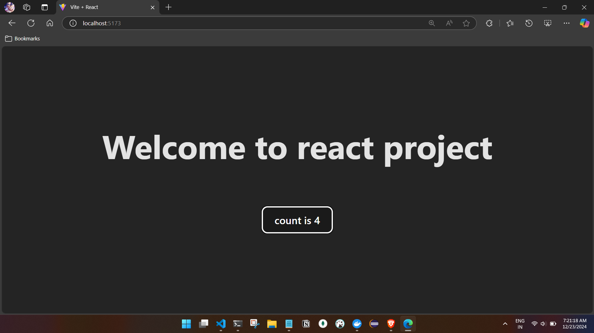
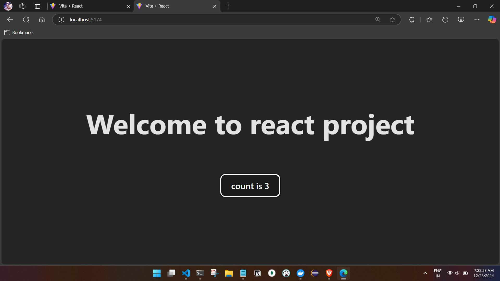

# Dockerize the React app


## Check the node and npm(package manager) versions 
```

C:\Users\ashfa>node -v
v20.11.0

C:\Users\ashfa>npm -v
10.2.4


```
## Create a vite(build manager) react app 
[Link to create project](https://v3.vitejs.dev/guide/)
- Make changes.
- Test the application.

## Update vite config to support Docker
To run your React app in a Docker container, you need to update the vite config file to support Docker. Open the vite.config.js file and add the following code:

```
export default {
  server: {
    host: true,
  },
};
```
- Test the application.
## Create the Dockerfile
```
# Use an official Node.js runtime as a parent image
FROM node:20-alpine

# Set the working directory in the container
WORKDIR /app

# Copy package.json and package-lock.json to the working directory
COPY package*.json ./

# Install app dependencies
RUN npm install

# Copy the rest of your application code to the working directory
COPY . .

# Expose a port to communicate with the React app
EXPOSE 5173

# Start your React app
CMD ["npm", "run", "dev"]
```

- also create a .dockerignore file and add
```
node_modules
dist
*.log

```

- From terminal build the docker image.
```


C:\Users\ashfa\OneDrive\Desktop\My-Learning\k8s\kubernetes\k8s-with-react\simple-react-app>docker build -t vite-react-app:v1  .  
[+] Building 1.2s (10/10) FINISHED                                                                         docker:desktop-linux
 => [internal] load build definition from Dockerfile                                                                       0.0s
 => => transferring dockerfile: 492B                                                                                       0.0s
 => [internal] load metadata for docker.io/library/node:20-alpine                                                          1.0s
 => [internal] load .dockerignore                                                                                          0.0s
 => => transferring context: 64B                                                                                           0.0s
 => [1/5] FROM docker.io/library/node:20-alpine@sha256:426f843809ae05f324883afceebaa2b9cab9cb697097dbb1a2a7a41c5701de72    0.0s
 => [internal] load build context                                                                                          0.0s
 => => transferring context: 1.24kB                                                                                        0.0s
 => CACHED [2/5] WORKDIR /app                                                                                              0.0s
 => CACHED [3/5] COPY package*.json ./                                                                                     0.0s
 => CACHED [4/5] RUN npm install                                                                                           0.0s
 => [5/5] COPY . .                                                                                                         0.0s
 => => transferring context: 64B                                                                                           0.0s
 => [1/5] FROM docker.io/library/node:20-alpine@sha256:426f843809ae05f324883afceebaa2b9cab9cb697097dbb1a2a7a41c5701de72    0.0s
 => [internal] load build context                                                                                          0.0s
 => => transferring context: 1.24kB                                                                                        0.0s
 => CACHED [2/5] WORKDIR /app                                                                                              0.0s
 => CACHED [3/5] COPY package*.json ./                                                                                     0.0s
 => CACHED [4/5] RUN npm install                                                                                           0.0s
 => [5/5] COPY . .                                                                                                         0.0s
 => [internal] load build context                                                                                          0.0s
 => => transferring context: 1.24kB                                                                                        0.0s
 => CACHED [2/5] WORKDIR /app                                                                                              0.0s
 => CACHED [3/5] COPY package*.json ./                                                                                     0.0s
 => CACHED [4/5] RUN npm install                                                                                           0.0s
 => [5/5] COPY . .                                                                                                         0.0s
 => => transferring context: 1.24kB                                                                                        0.0s
 => CACHED [2/5] WORKDIR /app                                                                                              0.0s
 => CACHED [3/5] COPY package*.json ./                                                                                     0.0s
 => CACHED [4/5] RUN npm install                                                                                           0.0s
 => [5/5] COPY . .                                                                                                         0.0s
 => exporting to image                                                                                                     0.0s
 => => exporting layers                                                                                                    0.0s
 => CACHED [4/5] RUN npm install                                                                                           0.0s
 => [5/5] COPY . .                                                                                                         0.0s
 => exporting to image                                                                                                     0.0s
 => => exporting layers                                                                                                    0.0s
 => exporting to image                                                                                                     0.0s
 => => exporting layers                                                                                                    0.0s
 => => writing image sha256:d0cd0356e83aa429b2d62c88d728bf07347cb03225a2c67115082cbf695e5414                               0.0s
 => => writing image sha256:d0cd0356e83aa429b2d62c88d728bf07347cb03225a2c67115082cbf695e5414                               0.0s
 => => naming to docker.io/library/vite-react-app:v1                                                                       0.0s

View build details: docker-desktop://dashboard/build/desktop-linux/desktop-linux/pu1580eu0rn3cvlo9vnaf6qlh

What's next:
    View a summary of image vulnerabilities and recommendations → docker scout quickview

C:\Users\ashfa\OneDrive\Desktop\My-Learning\k8s\kubernetes\k8s-with-react\simple-react-app>

```


- Run the docker image 
```
C:\Users\ashfa>docker run -p 5173:5173 vite-react-app:v1

> simple-react-app@0.0.0 dev
> vite


  VITE v6.0.5  ready in 310 ms

  ➜  Local:   http://localhost:5173/
  ➜  Network: http://172.17.0.2:5173/

```



- Running on diff port
```

C:\Users\ashfa>docker run -p 5174:5173 vite-react-app:v1

> simple-react-app@0.0.0 dev
> vite


  VITE v6.0.5  ready in 338 ms

  ➜  Local:   http://localhost:5173/
  ➜  Network: http://172.17.0.3:5173/


```

