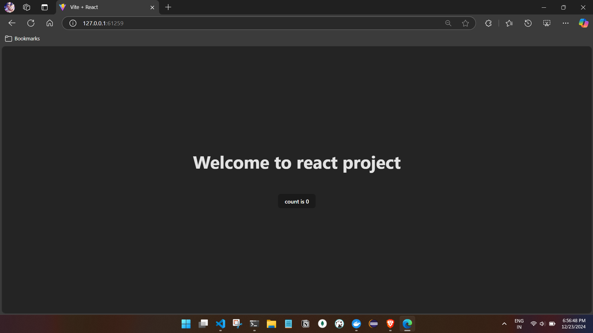
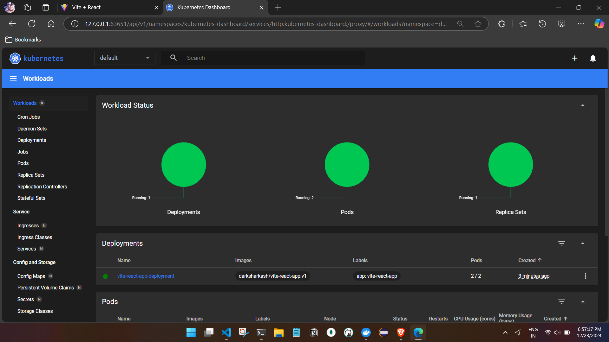

# Working with K8s and React

## Create a docker image for the react app.
- created and tested
## Create a deployment and service for the react app.
```
apiVersion: apps/v1
kind: Deployment
metadata:
  name: vite-react-app-deployment
  labels:
    app: vite-react-app
spec:
  replicas: 2 # Number of pods
  selector:
    matchLabels:
      app: vite-react-app
  template:
    metadata:
      labels:
        app: vite-react-app
    spec:
      containers:
      - name: reactapp
        image: darksharkash/vite-react-app:v1 # our Docker image
        ports:
        - containerPort: 5173 # Exposed port in the container
        imagePullPolicy: IfNotPresent # Ensure the image is not pulled from a remote registry
---
apiVersion: v1
kind: Service
metadata:
  name: vite-react-app-service
spec:
  selector:
    app: vite-react-app
  ports:
    - protocol: TCP
      port: 80 # External port
      targetPort: 5173   # The port exposed by the service
      nodePort: 31000
  type: NodePort # Exposes the service to the host machine

```

## Apply the YAML file  and test the application.

```
C:\Users\ashfa\OneDrive\Desktop\My-Learning\k8s\kubernetes\k8s-with-react\simple-react-app>kubectl apply -f ng-deployment.yaml
deployment.apps/vite-react-app-deployment created
service/vite-react-app-service created

C:\Users\ashfa\OneDrive\Desktop\My-Learning\k8s\kubernetes\k8s-with-react\simple-react-app>kubectl get deployments
NAME                        READY   UP-TO-DATE   AVAILABLE   AGE
vite-react-app-deployment   2/2     2            2           11s

C:\Users\ashfa\OneDrive\Desktop\My-Learning\k8s\kubernetes\k8s-with-react\simple-react-app>kubectl get services
NAME                     TYPE        CLUSTER-IP      EXTERNAL-IP   PORT(S)        AGE
kubernetes               ClusterIP   10.96.0.1       <none>        443/TCP        4d6h
vite-react-app-service   NodePort    10.110.20.158   <none>        80:31000/TCP   20s

C:\Users\ashfa\OneDrive\Desktop\My-Learning\k8s\kubernetes\k8s-with-react\simple-react-app>minikube service vite-react-app-service
|-----------|------------------------|-------------|---------------------------|
| NAMESPACE |          NAME          | TARGET PORT |            URL            |
|-----------|------------------------|-------------|---------------------------|
| default   | vite-react-app-service |          80 | http://192.168.49.2:31000 |
|-----------|------------------------|-------------|---------------------------|
🏃  Starting tunnel for service vite-react-app-service.
|-----------|------------------------|-------------|------------------------|
| NAMESPACE |          NAME          | TARGET PORT |          URL           |
|-----------|------------------------|-------------|------------------------|
| default   | vite-react-app-service |             | http://127.0.0.1:61259 |
|-----------|------------------------|-------------|------------------------|
🎉  Opening service default/vite-react-app-service in default browser...
❗  Because you are using a Docker driver on windows, the terminal needs to be open to run it.

```
- Application

- Minikube dashboard 


