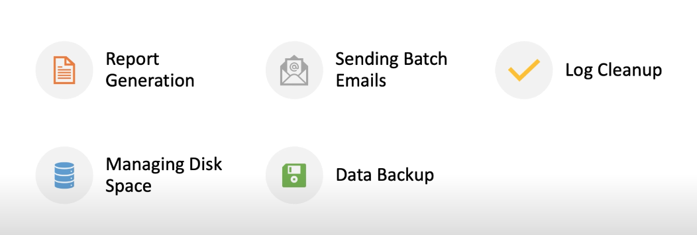
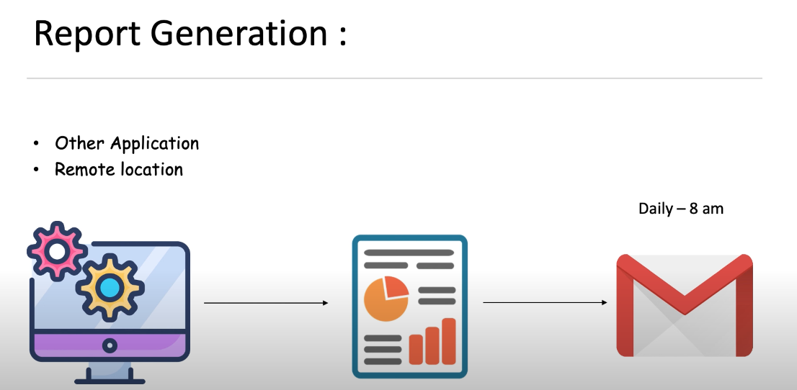
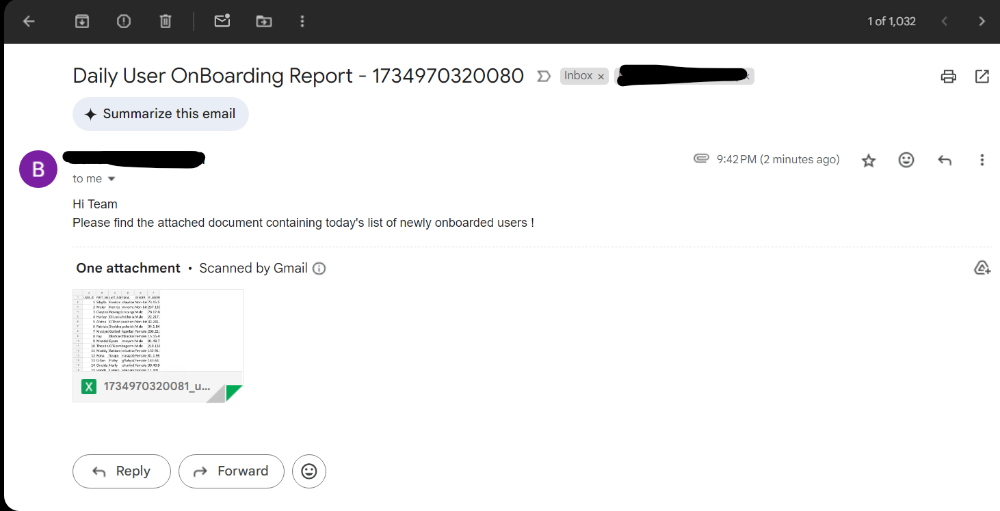
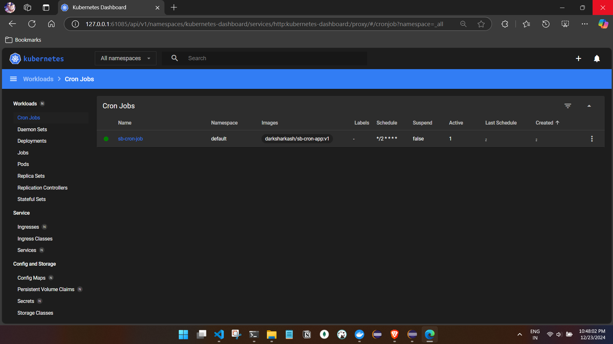
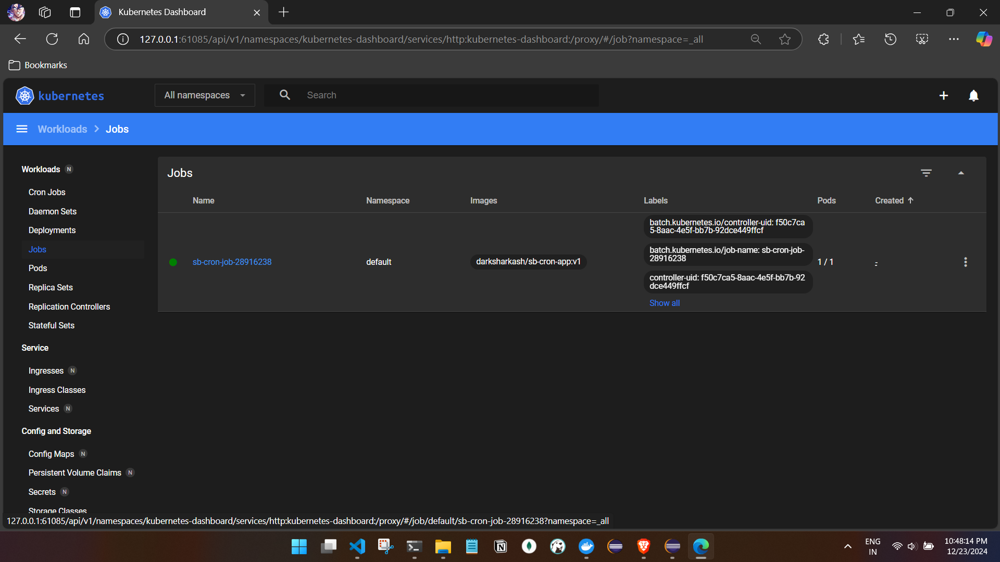
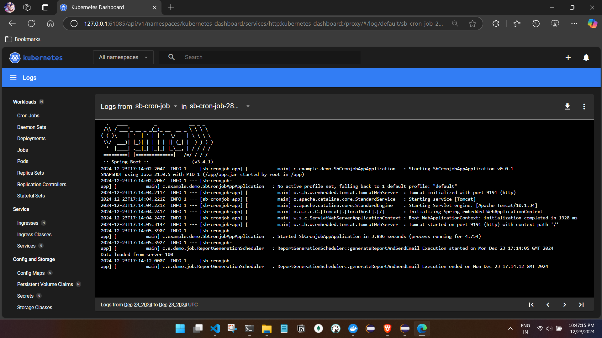
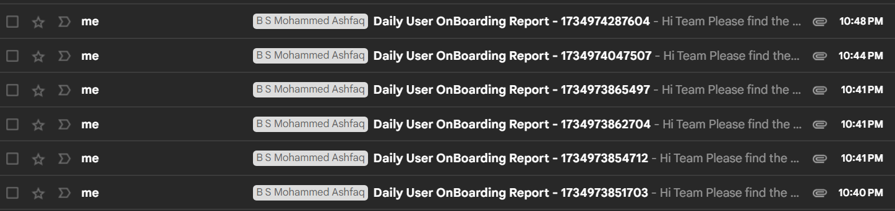

# Cron jobs
- In real time task scheduling is an essential aspect of managing the recurring jobs or automated  the process to handle the recurring jobs.

for example:





## Code 
- A spring application which reads a csv file and processes it and sends in a mail for every 2 mins 
- The schedule is set to run every 2 mins and is achieved by the scheduler.

- We are not exposing any service or endpoint from this application.
- We will remove the line ```	@Scheduled(cron = "0 */2 * * * *")``` as we will not schedule from the app but we will
schedule it from K8s and we will define the function there.
- How k8s will call this function is running the main class of the application

```
@SpringBootApplication

public class SbCronjobAppApplication implements CommandLineRunner {
	
	  @Autowired
	    private ReportGenerationScheduler scheduler;

	public static void main(String[] args) {
		SpringApplication.run(SbCronjobAppApplication.class, args);
	}

	@Override
	public void run(String... args) throws Exception {
		scheduler.generateReportAndSendEmail();
	}
}
```

- Start the minikube and refer to docker-env.
- Create the docker image for the application.
- Dockerfile
```
# Use an Alpine-based JDK 17 as the base image
FROM eclipse-temurin:21-jre-alpine

# Set the working directory inside the container
WORKDIR /app

# Expose the port your application will listen on
EXPOSE 8080

# Copy the JAR into /app and rename it to app.jar
ADD target/sb-cron-app.jar /app/app.jar

# Define the entry point command to run the application
ENTRYPOINT ["java", "-jar", "/app/app.jar"]


```

- Verify the image 
```

C:\Users\ashfa\OneDrive\Desktop\My-Learning\Java\Code\SB-k8s\sb-cronjob-app>docker build -t darksharkash/sb-cron-app:v1 .
[+] Building 4.8s (9/9) FINISHED                                                                                                       docker:desktop-linux
 => [internal] load build definition from Dockerfile                                                                                                   0.0s
 => => transferring dockerfile: 453B                                                                                                                   0.0s
 => [internal] load metadata for docker.io/library/eclipse-temurin:21-jre-alpine                                                                       2.5s
 => [auth] library/eclipse-temurin:pull token for registry-1.docker.io                                                                                 0.0s
 => [internal] load .dockerignore                                                                                                                      0.0s
 => => transferring context: 2B                                                                                                                        0.0s
 => [1/3] FROM docker.io/library/eclipse-temurin:21-jre-alpine@sha256:2a0bbb1db6d8db42c66ed00c43d954cf458066cc37be12b55144781da7864fdf                 0.0s
 => [internal] load build context                                                                                                                      1.3s
 => => transferring context: 41.38MB                                                                                                                   1.3s
 => CACHED [2/3] WORKDIR /app                                                                                                                          0.0s
 => [3/3] ADD target/sb-cron-app.jar /app/app.jar                                                                                                      0.8s
 => exporting to image                                                                                                                                 0.1s
 => => exporting layers                                                                                                                                0.1s
 => => writing image sha256:d2e18cd2d5b2102b0bf37d1b4759028b027679244fdfe9cabca8f9e128f7d111                                                           0.0s
 => => naming to docker.io/darksharkash/sb-cron-app:v1                                                                                                 0.0s

View build details: docker-desktop://dashboard/build/desktop-linux/desktop-linux/lcnv7zadunue93zyenxwq87xr

What's next:
    View a summary of image vulnerabilities and recommendations → docker scout quickview

C:\Users\ashfa\OneDrive\Desktop\My-Learning\Java\Code\SB-k8s\sb-cronjob-app>docker images
REPOSITORY                                TAG                                                                           IMAGE ID       CREATED         SIZE
darksharkash/sb-cron-app                  v1                                                                            d2e18cd2d5b2   8 seconds ago   251MB
```
- Run the image
```
C:\Users\ashfa\OneDrive\Desktop\My-Learning\Java\Code\SB-k8s\sb-cronjob-app>docker run -p 8080:8080 darksharkash/sb-cron-app:v1

  .   ____          _            __ _ _
 /\\ / ___'_ __ _ _(_)_ __  __ _ \ \ \ \
( ( )\___ | '_ | '_| | '_ \/ _` | \ \ \ \
 \\/  ___)| |_)| | | | | || (_| |  ) ) ) )
  '  |____| .__|_| |_|_| |_\__, | / / / /
 =========|_|==============|___/=/_/_/_/

 :: Spring Boot ::                (v3.4.1)

2024-12-23T16:27:06.534Z  INFO 1 --- [sb-cronjob-app] [           main] c.example.demo.SbCronjobAppApplication   : Starting SbCronjobAppApplication v0.0.1-SNAPSHOT using Java 21.0.5 with PID 1 (/app/app.jar started by root in /app)
2024-12-23T16:27:06.537Z  INFO 1 --- [sb-cronjob-app] [           main] c.example.demo.SbCronjobAppApplication   : No active profile set, falling back to 1 default profile: "default"
2024-12-23T16:27:07.229Z  INFO 1 --- [sb-cronjob-app] [           main] o.s.b.w.embedded.tomcat.TomcatWebServer  : Tomcat initialized with port 9191 (http)
2024-12-23T16:27:07.242Z  INFO 1 --- [sb-cronjob-app] [           main] o.apache.catalina.core.StandardService   : Starting service [Tomcat]
2024-12-23T16:27:07.243Z  INFO 1 --- [sb-cronjob-app] [           main] o.apache.catalina.core.StandardEngine    : Starting Servlet engine: [Apache Tomcat/10.1.34]
2024-12-23T16:27:07.270Z  INFO 1 --- [sb-cronjob-app] [           main] o.a.c.c.C.[Tomcat].[localhost].[/]       : Initializing Spring embedded WebApplicationContext
2024-12-23T16:27:07.271Z  INFO 1 --- [sb-cronjob-app] [           main] w.s.c.ServletWebServerApplicationContext : Root WebApplicationContext: initialization completed in 695 ms
2024-12-23T16:27:07.588Z  INFO 1 --- [sb-cronjob-app] [           main] o.s.b.w.embedded.tomcat.TomcatWebServer  : Tomcat started on port 9191 (http) with context path '/'
2024-12-23T16:27:07.599Z  INFO 1 --- [sb-cronjob-app] [           main] c.example.demo.SbCronjobAppApplication   : Started SbCronjobAppApplication in 1.424 seconds (process running for 1.851)
2024-12-23T16:27:07.602Z  INFO 1 --- [sb-cronjob-app] [           main] c.e.demo.job.ReportGenerationScheduler   : ReportGenerationScheduler::generateReportAndSendEmail Execution started on Mon Dec 23 16:27:07 GMT 2024
Data loaded from server 100
2024-12-23T16:27:12.740Z  INFO 1 --- [sb-cronjob-app] [           main] c.e.demo.job.ReportGenerationScheduler   : ReportGenerationScheduler::generateReportAndSendEmail Execution ended on Mon Dec 23 16:27:12 GMT 2024
2024-12-23T16:27:24.865Z  INFO 1 --- [sb-cronjob-app] [ionShutdownHook] o.s.b.w.e.tomcat.GracefulShutdown        : Commencing graceful shutdown. Waiting for active requests to complete
2024-12-23T16:27:24.868Z  INFO 1 --- [sb-cronjob-app] [tomcat-shutdown] o.s.b.w.e.tomcat.GracefulShutdown        : Graceful shutdown complete
```

- Create the YAML file here we will create a CronjobJob object.

```
apiVersion: batch/v1
kind: CronJob # Kubernetes resource kind we are creating, CronJob is a k8s object
metadata:
  name: sb-cron-job # name of the CronJob
spec:
  schedule: "*/2 * * * *" # cron schedule this will run every 2 mins
  successfulJobsHistoryLimit: 1 # Number of successful jobs to keep
  failedJobsHistoryLimit: 5 # Number of failed jobs to keep IMP this clears the pods , as new pods are created as per cron
  jobTemplate:
    spec:
      template:
        spec:
          containers:
            - name: sb-cron-job
              image: darksharkash/sb-cron-app:v1
              imagePullPolicy: IfNotPresent
          restartPolicy: OnFailure
```

- Run the YAML file and verify .
```

C:\Users\ashfa\OneDrive\Desktop\My-Learning\Java\Code\SB-k8s\sb-cronjob-app>kubectl apply -f k8s.yaml
cronjob.batch/sb-cron-job created

C:\Users\ashfa\OneDrive\Desktop\My-Learning\Java\Code\SB-k8s\sb-cronjob-app>kubectl get cronjobs
NAME          SCHEDULE      TIMEZONE   SUSPEND   ACTIVE   LAST SCHEDULE   AGE
sb-cron-job   */2 * * * *   <none>     False     0        <none>          11s


-minikube dashboard 
C:\Users\ashfa>minikube dashboard
🤔  Verifying dashboard health ...
🚀  Launching proxy ...
🤔  Verifying proxy health ...
🎉  Opening http://127.0.0.1:61085/api/v1/namespaces/kubernetes-dashboard/services/http:kubernetes-dashboard:/proxy/ in your default browser...


```


- minikube dashboard:





- mail:



## Observation:
Every time the cron schedule triggers (e.g., every two minutes), Kubernetes creates a new Pod. This new Pod runs your application, and since your Spring Boot app is designed to execute the function once on startup, the function gets called every time the Pod is created. 


1. **Handling Overlapping Pods**: By default, Kubernetes allows Pods to overlap, meaning if the previous Pod is still running when the next CronJob is triggered, the new Pod will still start. However, we can control this behavior using the `concurrencyPolicy` field in the CronJob YAML:
   - **Forbid**: Ensures that if a previous Pod is still running, the next scheduled job won't start.
   - **Replace**: Stops the currently running Pod and replaces it with a new one.

2. **Pod Lifecycle**: Once a Pod completes its execution (i.e., our application finishes its one-time function call), it moves to the `Completed` state. However, it remains in the cluster unless explicitly cleaned up. To avoid resource consumption:
   - Use `successfulJobsHistoryLimit` and `failedJobsHistoryLimit` to automatically delete old job metadata after a certain number of jobs.
   - Set `ttlSecondsAfterFinished` to define how long Kubernetes should keep the Pod after it finishes. For example, `ttlSecondsAfterFinished: 60` will delete the Pod one minute after it completes.

3. **Resource Consumption**: To optimize resource usage:
   - Set `restartPolicy: Never` in the Job spec, so the Pod won't restart on failure.
   - Ensure that resource requests/limits are defined in the YAML, so the Pod doesn’t consume unnecessary CPU or memory.

eg YAML
```
apiVersion: batch/v1
kind: CronJob
metadata:
  name: example-cronjob
spec:
  # Schedule the job to run every 2 minutes
  schedule: "*/2 * * * *"
  
  # Concurrency policy to forbid overlapping runs (i.e., only one pod running at a time)
  concurrencyPolicy: Forbid
  
  # How many successful jobs to keep in the history
  successfulJobsHistoryLimit: 3
  
  # How many failed jobs to keep in the history
  failedJobsHistoryLimit: 1

  # How long to keep the Pod after it finishes (TTL for completed Pods)
  ttlSecondsAfterFinished: 60  # Delete the Pod 1 minute after completion

  jobTemplate:
    spec:
      template:
        spec:
          containers:
          - name: your-springboot-app
            # Define the Docker image to use for the Pod
            image: your-docker-image
            command: ["java", "-jar", "your-app.jar"]  # The command to run in the container
            resources:
              # Define resource requests and limits
              requests:
                memory: "64Mi"
                cpu: "250m"
              limits:
                memory: "128Mi"
                cpu: "500m"
          restartPolicy: Never  # Don't restart the Pod once it finishes

```

Excellent question, Mohammed Ashfaq! Let's break it down step by step:

### How Kubernetes Knows When a Container Is Completed

1. **Container Exit Code**:
   - When the application (inside the container) completes its execution, the container process exits with an **exit code**. 
   - If the process completes successfully, it typically exits with `exit code 0`.
   - Kubernetes monitors the container's status and checks the exit code to determine if it finished successfully.

2. **Pod Phase Tracking**:
   - Kubernetes tracks the lifecycle of a Pod. Once the container inside the Pod completes, the Pod moves to the `Succeeded` or `Failed` phase based on the exit code.
   - If a Pod reaches the `Succeeded` phase, Kubernetes considers the Pod's job done.

3. **Job and CronJob Behavior**:
   - For a **Job** (or CronJob), Kubernetes relies on the Pod's `Succeeded` status to know the task is complete.
   - The CronJob's `concurrencyPolicy` (e.g., `Forbid`) ensures that if a job's Pod hasn't completed, Kubernetes won't start a new Pod for the next Cron trigger.

### In Our Case: The Spring Boot Application Inside the Container

When we containerize our Spring Boot application:
1. The logic (e.g., calling a function on application start) runs **once** when the application starts.
2. Once the logic completes, the `java` process inside the container exits with a status code of `0`.
3. Kubernetes detects the container's exit status and marks the Pod as `Succeeded`.

If the Pod finishes before the next CronJob schedule, Kubernetes is ready to create a new Pod. However:
- If the Pod is still running, the `concurrencyPolicy` (e.g., `Forbid`) ensures no new Pod starts until the running one finishes.

### Example Workflow:
1. **Cron Schedule**: The CronJob is set to run every 2 minutes.
2. **Pod Lifecycle**:
   - At `T=0`: Kubernetes starts a Pod.
   - The Pod runs the containerized Spring Boot application.
   - The application calls the function once and exits.
   - Kubernetes marks the Pod as `Succeeded`.
3. **Next Run**:
   - At `T=2`: Kubernetes starts a new Pod, repeating the process.

If the first Pod hasn’t completed by `T=2`:
- If `concurrencyPolicy: Forbid`, the new job won’t start.
- If `concurrencyPolicy: Allow`, Kubernetes will create a new Pod regardless of the previous one.

### Key Insight:
Kubernetes doesn’t care about what’s inside the container; it only looks at the process’s exit status and Pod lifecycle state to manage CronJob executions.


## Template Explanation for CronJob YAML

 ```
 apiVersion: batch/v1
kind: CronJob
metadata:
  name: <name-of-your-cronjob>  # Define a name for the CronJob
spec:
  schedule: "<cron-expression>"  # Cron expression defining the schedule (e.g., "*/2 * * * *" for every 2 minutes)
  
  concurrencyPolicy: <Forbid|Replace|Allow>  # Controls whether overlapping jobs are allowed. "Forbid" means no overlap.

  successfulJobsHistoryLimit: <number>  # Limit on how many successful job records are kept
  failedJobsHistoryLimit: <number>  # Limit on how many failed job records are kept
  
  ttlSecondsAfterFinished: <seconds>  # Defines how long to keep completed Pods (time-to-live for finished Pods)

  jobTemplate:
    spec:
      template:
        spec:
          containers:
          - name: <container-name>  # Name of the container
            image: <docker-image>  # Docker image for the container (your Spring Boot app)
            command: ["<command-to-run>"]  # The command to run inside the container (e.g., running the Spring Boot app)
            resources:
              requests:
                memory: "<memory-request>"
                cpu: "<cpu-request>"
              limits:
                memory: "<memory-limit>"
                cpu: "<cpu-limit>"
          restartPolicy: Never  # Don't restart the Pod once it completes or fails

 ```

 Here’s the breakdown for what you're asking about:

### Kubernetes CronJob Example YAML with Resource Management and Cleanup

This YAML configuration includes both resource management and Pod cleanup settings:

```yaml
apiVersion: batch/v1
kind: CronJob
metadata:
  name: example-cronjob
spec:
  # Schedule the job to run every 2 minutes
  schedule: "*/2 * * * *"
  
  # Concurrency policy to forbid overlapping runs (i.e., only one pod running at a time)
  concurrencyPolicy: Forbid
  
  # How many successful jobs to keep in the history
  successfulJobsHistoryLimit: 3
  
  # How many failed jobs to keep in the history
  failedJobsHistoryLimit: 1

  # How long to keep the Pod after it finishes (TTL for completed Pods)
  ttlSecondsAfterFinished: 60  # Delete the Pod 1 minute after completion

  jobTemplate:
    spec:
      template:
        spec:
          containers:
          - name: your-springboot-app
            # Define the Docker image to use for the Pod
            image: your-docker-image
            command: ["java", "-jar", "your-app.jar"]  # The command to run in the container
            resources:
              # Define resource requests and limits
              requests:
                memory: "64Mi"
                cpu: "250m"
              limits:
                memory: "128Mi"
                cpu: "500m"
          restartPolicy: Never  # Don't restart the Pod once it finishes
```

### Template Explanation for CronJob YAML

```yaml
apiVersion: batch/v1
kind: CronJob
metadata:
  name: <name-of-your-cronjob>  # Define a name for the CronJob
spec:
  schedule: "<cron-expression>"  # Cron expression defining the schedule (e.g., "*/2 * * * *" for every 2 minutes)
  
  concurrencyPolicy: <Forbid|Replace|Allow>  # Controls whether overlapping jobs are allowed. "Forbid" means no overlap.

  successfulJobsHistoryLimit: <number>  # Limit on how many successful job records are kept
  failedJobsHistoryLimit: <number>  # Limit on how many failed job records are kept
  
  ttlSecondsAfterFinished: <seconds>  # Defines how long to keep completed Pods (time-to-live for finished Pods)

  jobTemplate:
    spec:
      template:
        spec:
          containers:
          - name: <container-name>  # Name of the container
            image: <docker-image>  # Docker image for the container (your Spring Boot app)
            command: ["<command-to-run>"]  # The command to run inside the container (e.g., running the Spring Boot app)
            resources:
              requests:
                memory: "<memory-request>"
                cpu: "<cpu-request>"
              limits:
                memory: "<memory-limit>"
                cpu: "<cpu-limit>"
          restartPolicy: Never  # Don't restart the Pod once it completes or fails
```

### Breakdown of Key Sections:
1. **`schedule`**: Defines when the job should run using a cron expression. For example, `"*/2 * * * *"` runs the job every 2 minutes.
2. **`concurrencyPolicy`**: Controls how Kubernetes handles overlapping job executions.  
   - `Forbid`: Prevents new jobs from starting if the previous one hasn’t finished.
   - `Replace`: Stops the running job and starts a new one.
   - `Allow`: Allows multiple jobs to run in parallel.
3. **`successfulJobsHistoryLimit`**: Limits the number of successful job records to keep.
4. **`failedJobsHistoryLimit`**: Limits the number of failed job records to keep.
5. **`ttlSecondsAfterFinished`**: Automatically deletes the Pod after it finishes, helping clean up resources.
6. **`jobTemplate`**: Defines the Pod template, specifying the container (your Spring Boot application), command to run, and resource limits.
   - `resources.requests`: What Kubernetes should reserve for the Pod to run (memory and CPU).
   - `resources.limits`: The maximum allowed resource usage for the Pod.

### Additional Notes:
- **Image**: The Docker image for your Spring Boot app (e.g., `your-docker-image`).
- **Resources**: This section helps manage the Pod’s resource consumption (like CPU and memory).
- **restartPolicy: Never**: Ensures that Kubernetes doesn’t try to restart the Pod once it’s completed, keeping it idle until the next CronJob trigger.


