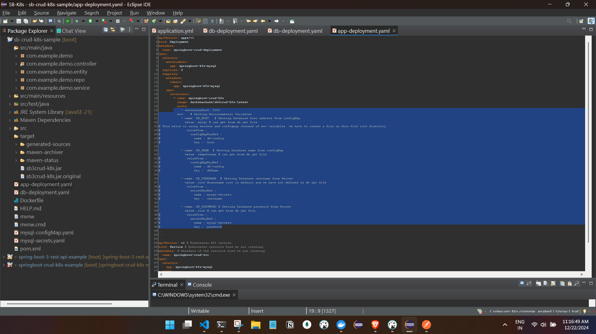

# K8s with Springboot Crud 

- Create a springboot application with local database.


- Tested the code with local DB and build is also sucessfull with local DB.

```
spring:
  datasource:
    driver-class-name: com.mysql.cj.jdbc.Driver
    url: jdbc:mysql://localhost:3306/temp?useSSL=false
    username: root
    password: admin
    hikari:
      initialization-fail-timeout: 0
  jpa:
    database-platform: org.hibernate.dialect.MySQLDialect
    generate-ddl: true
    show-sql: true
    hibernate:
      ddl-auto: update
```


### Now we need to dockerize the DB first and then dockerize the SB app and run so the application can use the database.
- Start the minikube 
- tell K8s to refer the Docker env


- Dockerizing the DB.
to use mysql in k8s we need to create a deployment object and to use it we need to create a service object also a PVC object as we are using DB instance.

a. create a yaml file which woll create a deployment, service and pvc objects.
```
# Define a 'Persistent Voulume Claim'(PVC) for Mysql Storage, dynamically provisioned by cluster
apiVersion: v1
kind: PersistentVolumeClaim # this will tell K8s to get the storage to run the DB instance
metadata:
  name: mysql-pv-claim # name of PVC essential for identifying the storage data
  labels:
    app: mysql
    tier: database
spec:
  accessModes:
    - ReadWriteOnce   #This specifies the mode of the claim that we are trying to create.
  resources:
    requests:
      storage: 1Gi    #We are asking K8s to provision 1Gi of storage. This will tell kubernetes about the amount of space we are trying to claim.
---
# Configure 'Deployment' of mysql server
apiVersion: apps/v1
kind: Deployment
metadata:
  name: mysql
  labels:
    app: mysql
    tier: database
spec:
  selector: # mysql Pod Should contain same labels
    matchLabels:
      app: mysql
      tier: database
  strategy:
    type: Recreate
  template:
    metadata:
      labels: # Must match 'Service' and 'Deployment' selectors
        app: mysql
        tier: database
    spec:
      containers:
        - image: mysql:5.7 # image from docker-hub
          args:
            - "--ignore-db-dir=lost+found" # Workaround for https://github.com/docker-library/mysql/issues/186
          name: mysql
          env:
            - name: MYSQL_ROOT_PASSWORD # Root username will always be 'root'
              value: root
                
            - name: MYSQL_DATABASE # Setting Database Name from a 'ConfigMap'
              value: tempSchema


          ports:
            - containerPort: 3306
              name: mysql
          volumeMounts:        # Mounting voulume obtained from Persistent Volume Claim
            - name: mysql-persistent-storage
              mountPath: /var/lib/mysql #This is the path in the container on which the mounting will take place.
      volumes:
        - name: mysql-persistent-storage # Obtaining 'vloume' from PVC
          persistentVolumeClaim:
            claimName: mysql-pv-claim # pointing to abouve PVC
---
# Define a 'Service' To Expose mysql to Other Services
apiVersion: v1
kind: Service
metadata:
  name: mysql  # DNS name IMP this will be the hostname
  labels:
    app: mysql
    tier: database
spec:
  ports:
    - port: 3306
      targetPort: 3306
  selector:       # mysql Pod Should contain same labels
    app: mysql
    tier: database
  clusterIP: None  # We Use DNS, Thus ClusterIP is not relevant
  # We are not specifying type of Service like NodePort or LoadBalancer for a DB instance, we will just access it using DNS and port.
```

```

C:\Users\ashfa\OneDrive\Desktop\My-Learning\Java\Code\SB-k8s\springboot-crud-k8s>kubectl apply -f db-deployment.yaml
O/P
persistentvolumeclaim/mysql-pv-claim created
deployment.apps/mysql created
service/mysql created

C:\Users\ashfa\OneDrive\Desktop\My-Learning\Java\Code\SB-k8s\springboot-crud-k8s>

```
- Verifying the deployment, service and pod:
```
C:\Users\ashfa\OneDrive\Desktop\My-Learning\Java\Code\SB-k8s\springboot-crud-k8s>kubectl apply -f db-deployment.yaml
persistentvolumeclaim/mysql-pv-claim created
deployment.apps/mysql created
service/mysql created

C:\Users\ashfa\OneDrive\Desktop\My-Learning\Java\Code\SB-k8s\springboot-crud-k8s>kubectl get deployments
NAME    READY   UP-TO-DATE   AVAILABLE   AGE
mysql   0/1     1            0           7s

C:\Users\ashfa\OneDrive\Desktop\My-Learning\Java\Code\SB-k8s\springboot-crud-k8s>kubectl get pods
NAME                    READY   STATUS    RESTARTS   AGE
mysql-bd958bf58-94qd6   0/1     Pending   0          14s

C:\Users\ashfa\OneDrive\Desktop\My-Learning\Java\Code\SB-k8s\springboot-crud-k8s>kubectl get pods
NAME                    READY   STATUS              RESTARTS   AGE
mysql-bd958bf58-94qd6   0/1     ContainerCreating   0          69s

C:\Users\ashfa\OneDrive\Desktop\My-Learning\Java\Code\SB-k8s\springboot-crud-k8s>kubectl get pods
NAME                    READY   STATUS    RESTARTS   AGE
mysql-bd958bf58-94qd6   1/1     Running   0          3m52s

C:\Users\ashfa\OneDrive\Desktop\My-Learning\Java\Code\SB-k8s\springboot-crud-k8s>kubectl logs mysql-bd958bf58-94qd6
2024-12-21 17:12:29+00:00 [Note] [Entrypoint]: Entrypoint script for MySQL Server 5.7.44-1.el7 started.
2024-12-21 17:12:29+00:00 [Note] [Entrypoint]: Switching to dedicated user 'mysql'
2024-12-21 17:12:29+00:00 [Note] [Entrypoint]: Entrypoint script for MySQL Server 5.7.44-1.el7 started.
2024-12-21 17:12:29+00:00 [Note] [Entrypoint]: Initializing database files
2024-12-21T17:12:29.423630Z 0 [Warning] TIMESTAMP with implicit DEFAULT value is deprecated. Please use --explicit_defaults_for_timestamp server option (see documentation for more details).
2024-12-21T17:12:29.559932Z 0 [Warning] InnoDB: New log files created, LSN=45790
2024-12-21T17:12:29.585730Z 0 [Warning] InnoDB: Creating foreign key constraint system tables.
2024-12-21T17:12:29.591984Z 0 [Warning] No existing UUID has been found, so we assume that this is the first time that this server has been started. Generating a new UUID: c2475098-bfbe-11ef-b623-c2023fadcfda.
2024-12-21T17:12:36.088739Z 0 [Warning] CA certificate ca.pem is self signed.
2024-12-21T17:12:36.088779Z 0 [Note] Skipping generation of RSA key pair as key files are present in data directory.
2024-12-21T17:12:36.088950Z 0 [Note] Server hostname (bind-address): '*'; port: 3306
2024-12-21T17:12:36.088988Z 0 [Note] IPv6 is available.
2024-12-21T17:12:36.088995Z 0 [Note]   - '::' resolves to '::';
2024-12-21T17:12:36.089003Z 0 [Note] Server socket created on IP: '::'.
2024-12-21T17:12:36.090474Z 0 [Warning] Insecure configuration for --pid-file: Location '/var/run/mysqld' in the path is accessible to all OS users. Consider choosing a different directory.
2024-12-21T17:12:36.094345Z 0 [Note] Event Scheduler: Loaded 0 events
2024-12-21T17:12:36.094557Z 0 [Note] mysqld: ready for connections.
Version: '5.7.44'  socket: '/var/run/mysqld/mysqld.sock'  port: 3306  MySQL Community Server (GPL)

C:\Users\ashfa\OneDrive\Desktop\My-Learning\Java\Code\SB-k8s\springboot-crud-k8s>kubectl get service
NAME         TYPE        CLUSTER-IP   EXTERNAL-IP   PORT(S)    AGE
kubernetes   ClusterIP   10.96.0.1    <none>        443/TCP    2d10h
mysql        ClusterIP   None         <none>        3306/TCP   7m39s

```


- Verifying the DB :

```
C:\Users\ashfa\OneDrive\Desktop\My-Learning\Java\Code\SB-k8s\springboot-crud-k8s>kubectl get pods
NAME                    READY   STATUS    RESTARTS   AGE
mysql-bd958bf58-94qd6   1/1     Running   0          17m

C:\Users\ashfa\OneDrive\Desktop\My-Learning\Java\Code\SB-k8s\springboot-crud-k8s>kubectl exec -it mysql-bd958bf58-94qd6 /bin/bash
kubectl exec [POD] [COMMAND] is DEPRECATED and will be removed in a future version. Use kubectl exec [POD] -- [COMMAND] instead.

bash-4.2# mysql -h mysql -u root -p
Enter password:
Welcome to the MySQL monitor.  Commands end with ; or \g.
Your MySQL connection id is 4
Server version: 5.7.44 MySQL Community Server (GPL)

Copyright (c) 2000, 2023, Oracle and/or its affiliates.

Oracle is a registered trademark of Oracle Corporation and/or its
affiliates. Other names may be trademarks of their respective
owners.

Type 'help;' or '\h' for help. Type '\c' to clear the current input statement.


mysql> show databases;
+--------------------+
| Database           |
+--------------------+
| information_schema |
| mysql              |
| performance_schema |
| sys                |
| tempSchema         |
+--------------------+
5 rows in set (0.01 sec)

mysql> use tempSchema
Database changed
mysql>


```
#### Note: 
if we didnot clear up the resources like deployment, service, and PVC and restart machine and 
we can see the resources will be present and start running once minikube starts and we can access the same DB as well.


### K8s with springboot backend
 - As we had tested our application with the local database.

 ```
 spring:
  datasource:
    driver-class-name: com.mysql.cj.jdbc.Driver
    url: jdbc:mysql://localhost:3306/temp?useSSL=false
    username: root
    password: admin
    hikari:
      initialization-fail-timeout: 0
  jpa:
    database-platform: org.hibernate.dialect.MySQLDialect
    generate-ddl: true
    show-sql: true
    hibernate:
      ddl-auto: update
 ```
####  We need to change this to Pod configuration i.e to the MYSQL pod which is running on minikube those config we need to add here . for now we can do a dynamic values (ENV values) later we can fetch from appdeployment.yml file(we will define the app ENV values) and our MYSQL container is running on minikube.

- Note: working explained
since we have given the dynamic values in  app yml file for DB configuration, how this works is create a image(while building in eclipse skip test) and when running the image we ill define the image name and version but we will also define the image ENV variables there when running the image the container will pick the ENV values for the DB

- adding pic for reference:


```
spring:
  datasource:
    driver-class-name: com.mysql.cj.jdbc.Driver
    url: jdbc:mysql://${DB_HOST}/${DB_NAME}?useSSL=false
    username: ${DB_USERNAME}
    password: ${DB_PASSWORD}
    hikari:
      initialization-fail-timeout: 0
  jpa:
    database-platform: org.hibernate.dialect.MySQL5Dialect
    generate-ddl: true
    show-sql: true
    hibernate:
      ddl-auto: update
``` 
#### Note in eclipse the build is going to fail if we select run as mvn build and clean install or clean package with skip test. 
- attaching the build success and failure scenario with eclipse in files  [build-error-logs](build-error-logs.txt) and
 [build-success-logs](build-success-logs.txt)
 


- Create the docker file:
```
# Use an Alpine-based JDK 21 as the base image
FROM eclipse-temurin:21-jre-alpine

# Set the working directory inside the container
WORKDIR /app

# Expose the port your application will listen on
EXPOSE 8080

# Add the application JAR to the container
ADD target/sb3crud-k8s.jar /app/app.jar

# Command to run the application
ENTRYPOINT ["java", "-jar", "/app/app.jar"]


```

- Create a docker image of the springboot app

```
C:\Users\ashfa\OneDrive\Desktop\My-Learning\Java\Code\SB-k8s\sb-crud-k8s-sample>docker build -t   darksharkash/sb3j21crud-k8s:latest .


C:\Users\ashfa>docker images
REPOSITORY  TAG IMAGE ID       CREATED          SIZE
darksharkash/sb3j21crud-k8s latest      60971bf44089   55 minutes ago   263MB

```
- Create the deployment and service object with yml config 

```
apiVersion: apps/v1
kind: Deployment
metadata:
  name: springboot-crud-deployment
spec:
  selector:
    matchLabels:
      app: springboot-k8s-mysql
  replicas: 3
  template:
    metadata:
      labels:
        app: springboot-k8s-mysql
    spec:
      containers:
        - name: springboot-crud-k8s
          image: darksharkash/sb3j21crud-k8s:latest
          ports:
            - containerPort: 8080
          env:   # Setting Enviornmental Variables
            - name: DB_HOST   # Setting Database host address from configMap
              value: mysql #we can get this data from db yml file
# This below is using secrets and configmap instead of env variables  we have to create a file in this file root directory         
#              valueFrom :            
#                configMapKeyRef :
#                  name : db-config
#                  key :  host

            - name: DB_NAME  # Setting Database name from configMap
              value: tempSchema # we can get this data from db yml file
#              valueFrom :
#                configMapKeyRef :
#                  name : db-config
#                  key :  dbName

            - name: DB_USERNAME  # Setting Database username from Secret
              value: root #username root is default and we have not defined in db yml file
#              valueFrom :
#                secretKeyRef :
#                  name : mysql-secrets
#                  key :  username

            - name: DB_PASSWORD # Setting Database password from Secret
              value: root # we can get this data from db yml file
#              valueFrom :
#                secretKeyRef :
#                  name : mysql-secrets
#                  key :  password

---

apiVersion: v1 # Kubernetes API version
kind: Service # Kubernetes resource kind we are creating
metadata: # Metadata of the resource kind we are creating
  name: springboot-crud-svc
spec:
  selector:
    app: springboot-k8s-mysql
  ports:
    - protocol: "TCP"
      port: 8080 # The port that the service is running on in the cluster
      targetPort: 8080 # The port exposed by the service
  type: NodePort # type of the service.


```


- Execute the app-deployment.yml file to create a deployment and service objects.
```
C:\Users\ashfa\OneDrive\Desktop\My-Learning\Java\Code\SB-k8s\sb-crud-k8s-sample> kubectl apply -f app-deployment.yaml

deployment.apps/springboot-crud-deployment created
service/springboot-crud-svc created

 
 - Verify :

 C:\Users\ashfa>kubectl get deployments
NAME                         READY   UP-TO-DATE   AVAILABLE   AGE
mysql                        1/1     1            1           16h
springboot-crud-deployment   0/3     3            0           6s

C:\Users\ashfa>kubectl get services
NAME                  TYPE        CLUSTER-IP       EXTERNAL-IP   PORT(S)          AGE
kubernetes            ClusterIP   10.96.0.1        <none>        443/TCP          3d2h
mysql                 ClusterIP   None             <none>        3306/TCP         16h
springboot-crud-svc   NodePort    10.104.237.110   <none>        8080:32714/TCP   10s

C:\Users\ashfa>kubectl get pods
NAME                                          READY   STATUS              RESTARTS        AGE
mysql-bd958bf58-94qd6                         1/1     Running             1 (4h15m ago)   16h
springboot-crud-deployment-5d7fc46bb9-5248v   0/1     ContainerCreating   0               16s
springboot-crud-deployment-5d7fc46bb9-8q88x   0/1     ContainerCreating   0               16s
springboot-crud-deployment-5d7fc46bb9-kq8s6   0/1     ContainerCreating   0               16s

C:\Users\ashfa>kubectl get pods
NAME                                          READY   STATUS    RESTARTS        AGE
mysql-bd958bf58-94qd6                         1/1     Running   1 (4h16m ago)   16h
springboot-crud-deployment-5d7fc46bb9-5248v   1/1     Running   0               113s
springboot-crud-deployment-5d7fc46bb9-8q88x   1/1     Running   0               113s
springboot-crud-deployment-5d7fc46bb9-kq8s6   1/1     Running   0               113s

- Check the logs: 

C:\Users\ashfa>kubectl logs springboot-crud-deployment-5d7fc46bb9-5248v

  .   ____          _            __ _ _
 /\\ / ___'_ __ _ _(_)_ __  __ _ \ \ \ \
( ( )\___ | '_ | '_| | '_ \/ _` | \ \ \ \
 \\/  ___)| |_)| | | | | || (_| |  ) ) ) )
  '  |____| .__|_| |_|_| |_\__, | / / / /
 =========|_|==============|___/=/_/_/_/

 :: Spring Boot ::                (v3.4.1)

2024-12-22T09:13:05.237Z  INFO 1 --- [sb-crud-k8s-sample] [           main] c.e.demo.SbCrudK8sSampleApplication      : Starting SbCrudK8sSampleApplication v0.0.1-SNAPSHOT using Java 21.0.5 with PID 1 (/app/app.jar started by root in /app)
2024-12-22T09:13:05.240Z  INFO 1 --- [sb-crud-k8s-sample] [           main] c.e.demo.SbCrudK8sSampleApplication      : No active profile set, falling back to 1 default profile: "default"
2024-12-22T09:13:11.336Z  INFO 1 --- [sb-crud-k8s-sample] [           main] .s.d.r.c.RepositoryConfigurationDelegate : Bootstrapping Spring Data JPA repositories in DEFAULT mode.
2024-12-22T09:13:11.828Z  INFO 1 --- [sb-crud-k8s-sample] [           main] .s.d.r.c.RepositoryConfigurationDelegate : Finished Spring Data repository scanning in 398 ms. Found 1 JPA repository interface.
2024-12-22T09:13:15.139Z  INFO 1 --- [sb-crud-k8s-sample] [           main] o.s.b.w.embedded.tomcat.TomcatWebServer  : Tomcat initialized with port 8080 (http)
2024-12-22T09:13:15.237Z  INFO 1 --- [sb-crud-k8s-sample] [           main] o.apache.catalina.core.StandardService   : Starting service [Tomcat]
2024-12-22T09:13:15.238Z  INFO 1 --- [sb-crud-k8s-sample] [           main] o.apache.catalina.core.StandardEngine    : Starting Servlet engine: [Apache Tomcat/10.1.34]
2024-12-22T09:13:15.345Z  INFO 1 --- [sb-crud-k8s-sample] [           main] o.a.c.c.C.[Tomcat].[localhost].[/]       : Initializing Spring embedded WebApplicationContext
2024-12-22T09:13:15.347Z  INFO 1 --- [sb-crud-k8s-sample] [           main] w.s.c.ServletWebServerApplicationContext : Root WebApplicationContext: initialization completed in 9514 ms
2024-12-22T09:13:16.635Z  INFO 1 --- [sb-crud-k8s-sample] [           main] o.hibernate.jpa.internal.util.LogHelper  : HHH000204: Processing PersistenceUnitInfo [name: default]
2024-12-22T09:13:17.143Z  INFO 1 --- [sb-crud-k8s-sample] [           main] org.hibernate.Version                    : HHH000412: Hibernate ORM core version 6.6.4.Final
2024-12-22T09:13:17.432Z  INFO 1 --- [sb-crud-k8s-sample] [           main] o.h.c.internal.RegionFactoryInitiator    : HHH000026: Second-level cache disabled
2024-12-22T09:13:19.629Z  INFO 1 --- [sb-crud-k8s-sample] [           main] o.s.o.j.p.SpringPersistenceUnitInfo      : No LoadTimeWeaver setup: ignoring JPA class transformer
2024-12-22T09:13:19.938Z  INFO 1 --- [sb-crud-k8s-sample] [           main] com.zaxxer.hikari.HikariDataSource       : HikariPool-1 - Starting...
2024-12-22T09:13:22.434Z  INFO 1 --- [sb-crud-k8s-sample] [           main] com.zaxxer.hikari.pool.HikariPool        : HikariPool-1 - Added connection com.mysql.cj.jdbc.ConnectionImpl@6d7b2319
2024-12-22T09:13:22.436Z  INFO 1 --- [sb-crud-k8s-sample] [           main] com.zaxxer.hikari.HikariDataSource       : HikariPool-1 - Start completed.
2024-12-22T09:13:22.940Z  WARN 1 --- [sb-crud-k8s-sample] [           main] org.hibernate.dialect.Dialect            : HHH000511: The 5.7.44 version for [org.hibernate.dialect.MySQLDialect] is no longer supported, hence certain features may not work properly. The minimum supported version is 8.0.0. Check the community dialects project for available legacy versions.
2024-12-22T09:13:22.946Z  WARN 1 --- [sb-crud-k8s-sample] [           main] org.hibernate.orm.deprecation            : HHH90000025: MySQLDialect does not need to be specified explicitly using 'hibernate.dialect' (remove the property setting and it will be selected by default)
2024-12-22T09:13:23.033Z  INFO 1 --- [sb-crud-k8s-sample] [           main] org.hibernate.orm.connections.pooling    : HHH10001005: Database info:
        Database JDBC URL [Connecting through datasource 'HikariDataSource (HikariPool-1)']
        Database driver: undefined/unknown
        Database version: 5.7.44
        Autocommit mode: undefined/unknown
        Isolation level: undefined/unknown
        Minimum pool size: undefined/unknown
        Maximum pool size: undefined/unknown
2024-12-22T09:13:26.947Z  INFO 1 --- [sb-crud-k8s-sample] [           main] o.h.e.t.j.p.i.JtaPlatformInitiator       : HHH000489: No JTA platform available (set 'hibernate.transaction.jta.platform' to enable JTA platform integration)
2024-12-22T09:13:27.050Z  INFO 1 --- [sb-crud-k8s-sample] [           main] j.LocalContainerEntityManagerFactoryBean : Initialized JPA EntityManagerFactory for persistence unit 'default'
2024-12-22T09:13:27.633Z  WARN 1 --- [sb-crud-k8s-sample] [           main] JpaBaseConfiguration$JpaWebConfiguration : spring.jpa.open-in-view is enabled by default. Therefore, database queries may be performed during view rendering. Explicitly configure spring.jpa.open-in-view to disable this warning
2024-12-22T09:13:29.728Z  INFO 1 --- [sb-crud-k8s-sample] [           main] o.s.b.w.embedded.tomcat.TomcatWebServer  : Tomcat started on port 8080 (http) with context path '/'
2024-12-22T09:13:29.831Z  INFO 1 --- [sb-crud-k8s-sample] [           main] c.e.demo.SbCrudK8sSampleApplication      : Started SbCrudK8sSampleApplication in 27.107 seconds (process running for 29.4)

C:\Users\ashfa>

```


- Test the code by calling the apis:


- Verify the database.


### Dashboard

```

C:\Users\ashfa>minikube dashboard
🤔  Verifying dashboard health ...
🚀  Launching proxy ...
🤔  Verifying proxy health ...
🎉  Opening http://127.0.0.1:60968/api/v1/namespaces/kubernetes-dashboard/services/http:kubernetes-dashboard:/proxy/ in your default browser...
```


#### Note:
As we can see in DB and SB app yaml files we have hardcoded the DB creds we can segerate this sensitive information of our application and keep out side the k8s. We will be using the config map and secrets.
