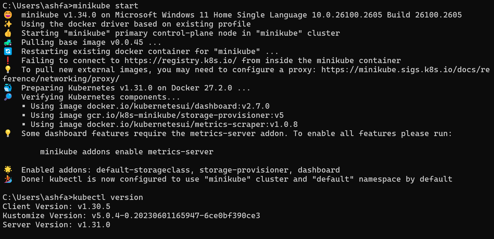
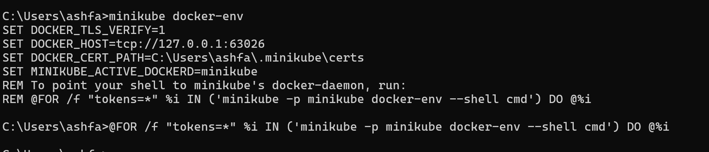
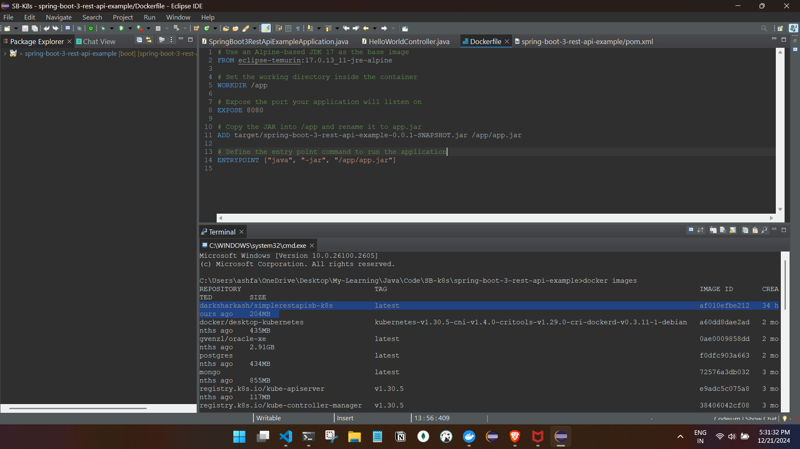
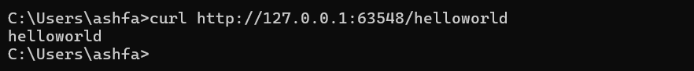
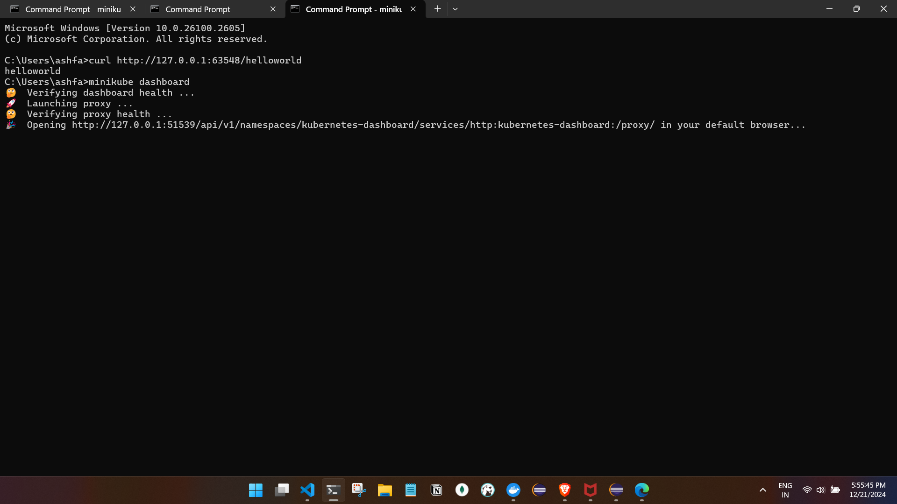
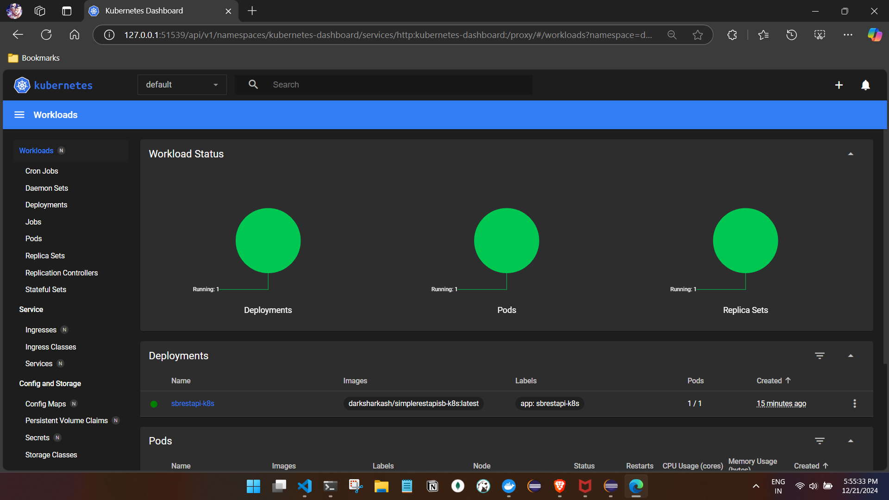
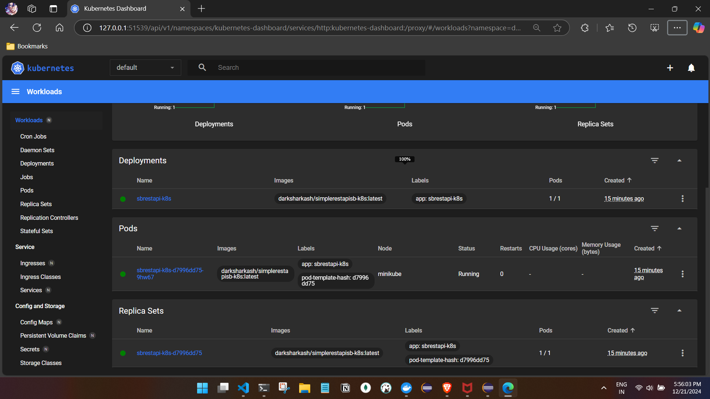
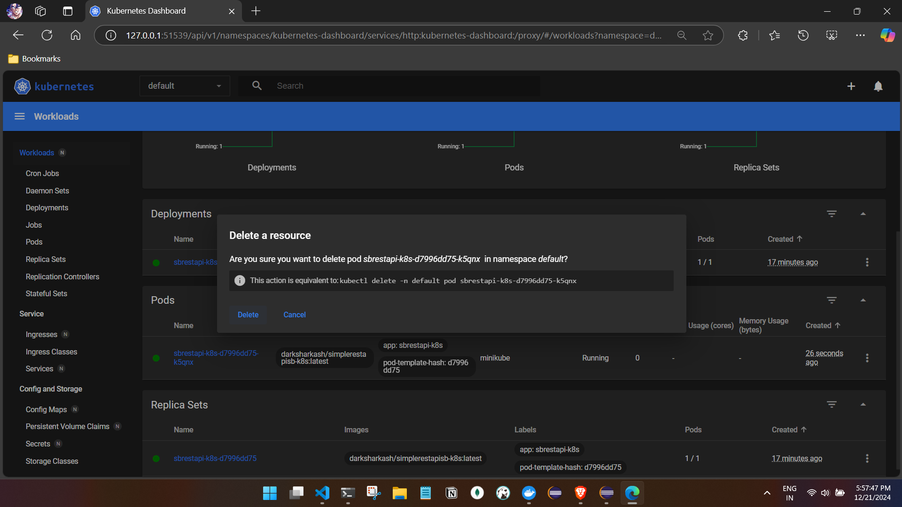
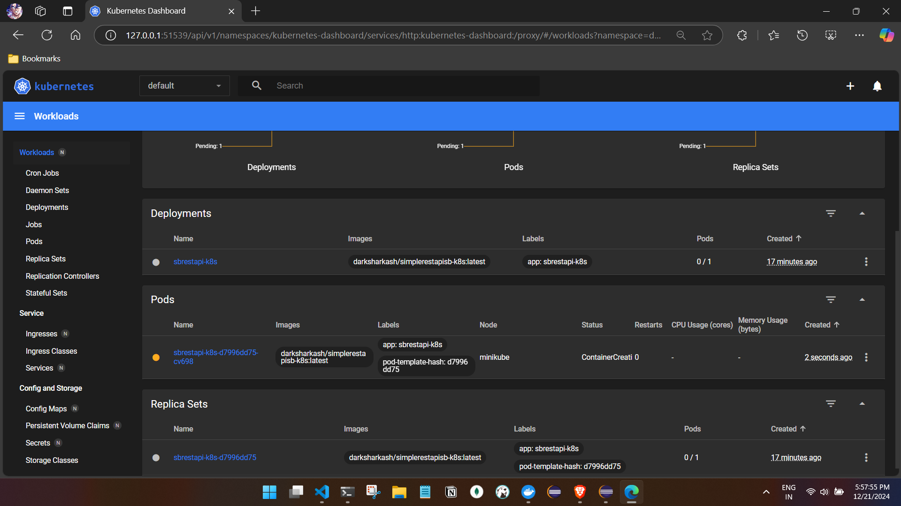
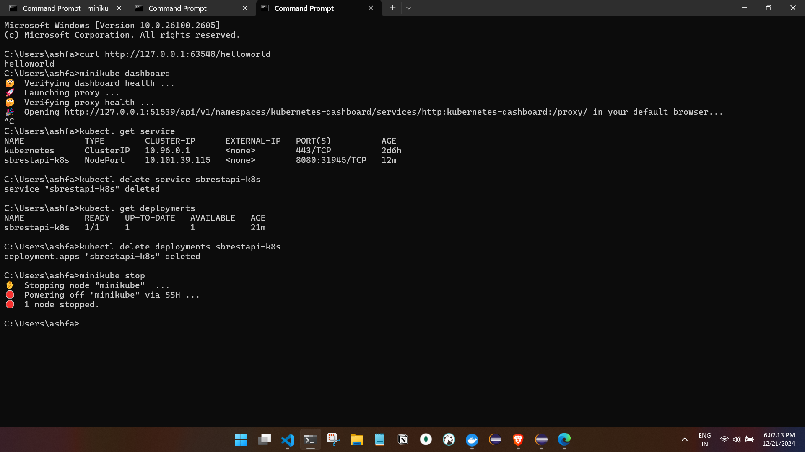

# K8s with SB Simple Rest API.

- Start and Verify the minikube and kubectl post starting the minikube.



- We need to tell K8s to refer the docker images   `minukube docker-env`

- Execute the last line post REM.



## Dockerize a Simple Rest API Spring boot application.


- this image should be ran as container in the pod of our minikube single node cluster.

- So we have to create a deployment object.
Note: Deployment are K8s objects that are used to managing the pods.

## Creating a Deployment object

### We can describe the deployment object in the following ways 

1. Using a yaml file

2. Using a kubectl command(we will use this now)

### Using a kubectl command to create a deployment object
- Start the minikube.
```
C:\Users\ashfa>
kubectl create deployment sbrestapi-k8s --image=darksharkash/simplerestapisb-k8s:latest -
-port=8080

O/P
deployment.apps/sbrestapi-k8s created(our deployment object is created)

```

- Verify the deployment object"
```
C:\Users\ashfa>kubectl get deployment

NAME            READY   UP-TO-DATE   AVAILABLE   AGE
sbrestapi-k8s   1/1     1 
```

- Describe the deployment object:
```
C:\Users\ashfa>kubectl describe  deployment sbrestapi-k8s
Name:                   sbrestapi-k8s
Namespace:              default
CreationTimestamp:      Sat, 21 Dec 2024 17:39:38 +0530
Labels:                 app=sbrestapi-k8s
Annotations:            deployment.kubernetes.io/revision: 1
Selector:               app=sbrestapi-k8s
Replicas:               1 desired | 1 updated | 1 total | 1 available | 0 unavailable
StrategyType:           RollingUpdate
MinReadySeconds:        0
RollingUpdateStrategy:  25% max unavailable, 25% max surge
Pod Template:
  Labels:  app=sbrestapi-k8s
  Containers:
   simplerestapisb-k8s:
    Image:         darksharkash/simplerestapisb-k8s:latest
    Port:          8080/TCP
    Host Port:     0/TCP
    Environment:   <none>
    Mounts:        <none>
  Volumes:         <none>
  Node-Selectors:  <none>
  Tolerations:     <none>
Conditions:
  Type           Status  Reason
  ----           ------  ------
  Available      True    MinimumReplicasAvailable
  Progressing    True    NewReplicaSetAvailable
OldReplicaSets:  <none>
NewReplicaSet:   sbrestapi-k8s-d7996dd75 (1/1 replicas created)
Events:
  Type    Reason             Age   From                   Message
  ----    ------             ----  ----                   -------
  Normal  ScalingReplicaSet  89s   deployment-controller  Scaled up replica set sbrestapi-k8s-d7996dd75 to 1

```

- To Ensure K8s pulled our docker image and run inside the pod we can run the following command:
```
C:\Users\ashfa>kubectl get pods

NAME                            READY   STATUS    RESTARTS   AGE
sbrestapi-k8s-d7996dd75-9hw67   1/1     Running   0          2m42s
```

- Check the logs of the pod:
```
C:\Users\ashfa>kubectl logs sbrestapi-k8s-d7996dd75-9hw67

  .   ____          _            __ _ _
 /\\ / ___'_ __ _ _(_)_ __  __ _ \ \ \ \
( ( )\___ | '_ | '_| | '_ \/ _` | \ \ \ \
 \\/  ___)| |_)| | | | | || (_| |  ) ) ) )
  '  |____| .__|_| |_|_| |_\__, | / / / /
 =========|_|==============|___/=/_/_/_/
 :: Spring Boot ::                (v3.0.1)

2024-12-21T12:09:47.121Z  INFO 1 --- [           main] s.r.SpringBoot3RestApiExampleApplication : Starting SpringBoot3RestApiExampleApplication v0.0.1-SNAPSHOT using Java 17.0.13 with PID 1 (/app/app.jar started by root in /app)
2024-12-21T12:09:47.197Z  INFO 1 --- [           main] s.r.SpringBoot3RestApiExampleApplication : No active profile set, falling back to 1 default profile: "default"
2024-12-21T12:09:51.836Z  INFO 1 --- [           main] o.s.b.w.embedded.tomcat.TomcatWebServer  : Tomcat initialized with port(s): 8080 (http)
2024-12-21T12:09:51.855Z  INFO 1 --- [           main] o.apache.catalina.core.StandardService   : Starting service [Tomcat]
2024-12-21T12:09:51.856Z  INFO 1 --- [           main] o.apache.catalina.core.StandardEngine    : Starting Servlet engine: [Apache Tomcat/10.1.4]
2024-12-21T12:09:52.210Z  INFO 1 --- [           main] o.a.c.c.C.[Tomcat].[localhost].[/]       : Initializing Spring embedded WebApplicationContext
2024-12-21T12:09:52.216Z  INFO 1 --- [           main] w.s.c.ServletWebServerApplicationContext : Root WebApplicationContext: initialization completed in 4677 ms
2024-12-21T12:09:54.211Z  INFO 1 --- [           main] o.s.b.w.embedded.tomcat.TomcatWebServer  : Tomcat started on port(s): 8080 (http) with context path ''
2024-12-21T12:09:54.313Z  INFO 1 --- [           main] s.r.SpringBoot3RestApiExampleApplication : Started SpringBoot3RestApiExampleApplication in 8.319 seconds (process running for 10.124)

C:\Users\ashfa>
```

- Access the application 

Accessing the url of the container  we need to create a service
object and we need to expose the current deployment with service type, so app can be accessd outside the cluster to our local machine.

- Expose to service
in service we have types and we will use NodePort type

- 1st. Get the deployment object and expose the object to the service.
```
C:\Users\ashfa>kubectl get deployments
O/P
NAME            READY   UP-TO-DATE   AVAILABLE   AGE
sbrestapi-k8s   1/1     1            1           8m9s

C:\Users\ashfa>kubectl expose deployments sbrestapi-k8s --type=NodePort
O/P
service/sbrestapi-k8s exposed
```

-2nd. Get the service object to get the URL.

```
C:\Users\ashfa>kubectl get service
NAME            TYPE        CLUSTER-IP      EXTERNAL-IP   PORT(S)          AGE
kubernetes      ClusterIP   10.96.0.1       <none>        443/TCP          2d5h
sbrestapi-k8s   NodePort    10.101.39.115   <none>        8080:31945/TCP   63s

C:\Users\ashfa>minikube service sbrestapi-k8s --url
http://127.0.0.1:63548

❗  Because you are using a Docker driver on windows, the terminal needs to be open to run it.
```
- Accessing the application.




## Minikube Dashboard
- For the above application we can check the dashboard and see the status of the application.

cmd: `minikube dashboard`







- Testing self healing, near the pods section of the dashboard. 
select the delete option once clicked we can see it will create a new Pod.

- deleting the pod.

- created a new pod.


#### As we can see the namespace is default 
 In Kubernetes, a **namespace** is essentially a way to logically divide and isolate resources within a cluster, much like having separate regions such as **DEV**, **PROD**, and **SIT** in an application lifecycle.


- **Namespace = Region**  
   Each namespace acts as a distinct environment (e.g., DEV, PROD, SIT) where we can manage resources separately.  

- **Isolation**  
   Resources in one namespace (e.g., DEV) do not interfere with those in another (e.g., PROD). This allows us to create isolated "regions" for different teams, applications, or lifecycle stages.  

- **Benefits**  
   1. **Resource Quotas**: we can allocate specific CPU, memory, or storage to namespaces to ensure environments don’t consume all cluster resources.  
   2. **Access Control**: Using Role-Based Access Control (RBAC), we can limit who can access each namespace. For example, developers might have full control over DEV but only read access to PROD.  
   3. **Naming Conflicts**: Namespaces prevent naming conflicts. For example, we can have a service named `app-service` in both DEV and PROD without issues.  

### Example Use Case:
- In DEV, we might deploy applications with debugging tools and lower resource limits.  
- In PROD, we might focus on high availability, scaling, and resource optimization.  

### Default Namespace:
If we don’t specify a namespace, Kubernetes places resources in the `default` namespace. However, it's good practice to explicitly create and use separate namespaces for clarity and management.  

### Creating a Namespace:  
To create a namespace, you can use the following command:  
```bash
kubectl create namespace dev
kubectl create namespace prod
```

### Using a Namespace:
To deploy resources into a specific namespace:  
```bash
kubectl apply -f deployment.yaml -n dev
```

we can also switch contexts to work within a specific namespace:  
```bash
kubectl config set-context --current --namespace=dev
```

This way, all subsequent commands will automatically apply to the `dev` namespace.

* Cleaning up resources

